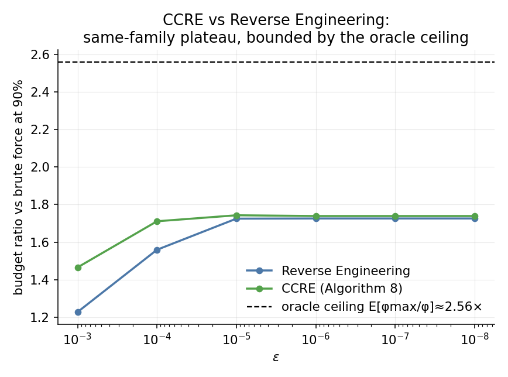

# CCRE — Confidence-Calibrated Reverse Engineering (Algorithm 8)

_Companion to `results/RESULTS.md` and `ladder/results/LADDER.md`; nothing there is modified. Same fixed-budget methodology (tune on seed 42, validate the winning config on seed 2024 at **R = 50,000**), same budget-to-90%-crossing definition, so the columns below are directly comparable to Table 3.2 and Table L1. New algorithm and code live entirely under `ccre/` and read `qmetrology`/`results`/`ladder` read-only — see `ccre/algorithms.py` for the mechanism._

## Why a same-family improvement, and its honest ceiling

`ladder/` breaks past the single-batch invertibility cap (`N*phi < pi/2`) via phase-unwrapping and reaches Heisenberg scaling — but that mechanism is structurally unlike anything in the thesis's own algorithm family. CCRE instead stays **strictly inside the principal branch**, like brute force, linear, binary, and reverse engineering: it never resolves a branch ambiguity, so it cannot leave the SQL cost class (cost-to-eps ~ 1/eps^2, same as all four). Its target is reverse engineering's ~1.72× plateau, not the ladder's unbounded growth — **any** principal-branch-only algorithm is capped by the population-average oracle ratio `E[phi_max/phi] ≈ 2.56×` under `U(0.01,0.1)` (a genie who knew phi exactly would pick `N*=floor(pi/(2*phi))`, giving budget ratio `phi_max/phi` per trial; RE's 1.72× already captures roughly two-thirds of that ceiling). This must not be oversold as a scaling breakthrough — it is a tighter constant factor, honestly reported below alongside the ladder for scale.

Reverse engineering (Algorithm 6) has two concrete weaknesses: (1) a single exploration shot with no correction, and (2) an ad hoc fixed multiplicative `safeguard` (0.9) that ignores how precise that one estimate actually was. CCRE fixes both while reusing patterns already in this codebase: binary search's `norm.ppf` confidence-bound machinery and the CRB-based safe-depth formula ladder's `_next_depth` already validated (its `n_principal` branch, minus the unwrap term). After a measurement gives `phi_hat` with CRB sd `sigma = 1/(2*N*sqrt(m))` (the delta-method variance of `arccos(sqrt(p_hat))/N` — the `sin^2(2*N*phi)` terms in `Var(p_hat)` and `(dp/dphi)^2` cancel exactly, so `sigma` is phi-independent, identical to what binary search and the ladder already use), the confidence-safe next depth is `N_safe = floor(pi / (2*(phi_hat + z*sigma)))` with `z = norm.ppf(conf)` — a principled, tunable replacement for RE's `0.9`, with a **provable** per-round overshoot bound `P(overshoot) ≈ 1-conf`. A small **fixed** number of confirmation rounds (`n_rounds`, tuned over {1,2,3}) each spend a constant `m_round` shots recomputing a deeper safe depth before the final round commits the remaining budget — a bounded-depth-growth generalization of RE, not an open-ended ladder.

## Table C1 — budget to reach 90% convergence vs precision  (U(0.01, 0.1))

_Same definition as Table 3.2 / Table L1: sweep budget, report the log-interpolated crossing at 90%. Ratio = brute ÷ algorithm. Ladder (unbounded) shown only for scale — it is a fundamentally different mechanism, not a same-family comparison._

| Algorithm | eps=1e-3 | eps=1e-4 | eps=1e-5 | eps=1e-6 | eps=1e-7 | eps=1e-8 |
|---|---:|---:|---:|---:|---:|---:|
| Brute force | 45,632 | 4,506,911 | 449,336,669 | 44,922,133,188 | 4,493,749,723,966 | 449,416,678,067,458 |
| Reverse Engineering | 37,197 (×1.23) | 2,890,389 (×1.56) | 260,409,882 (×1.73) | 26,032,940,408 (×1.73) | 2,603,752,722,984 (×1.73) | 260,373,770,844,500 (×1.73) |
| CCRE (Algorithm 8) | 31,157 (×1.47) | 2,633,935 (×1.71) | 257,790,246 (×1.74) | 25,838,240,172 (×1.74) | 2,584,108,246,282 (×1.74) | 258,420,066,957,448 (×1.74) |
| Ladder (unbounded, for scale) | 10,124 (×4.50) | 92,874 (×48.33) | 939,906 (×481.33) | 9,423,668 (×4812.62) | 93,031,533 (×48965.18) | 958,239,972 (×475233.75) |

## Table C1b — shifted range  U(0.001, 0.01), eps=1e-4

| Algorithm | budget to 90% |
|---|---:|
| Brute force | 439,569 |
| Reverse Engineering | 362,887 (×1.21) |
| CCRE (Algorithm 8) | 307,210 (×1.43) |

## Table C2 — % converged at fixed budget 10,000  (eps = 1e-3, U(0.01, 0.1))

_Table-3.1 operating point; CCRE row computed by `ccre/study.py::table31_check`._

| Algorithm | this work |
|---|---:|
| Brute force | 56.2% |
| Linear search | 56.6% |
| Binary search | 47.5% |
| Reverse Engineering | 60.3% |
| CCRE (Algorithm 8) | 65.3% (CI 64.9-65.8) |

## Overshoot rate: empirical vs the provable (1−conf) bound

_At the budget nearest CCRE's own 90% crossing: empirical `P(final N·phi ≥ pi/2)` vs the predicted `1-conf` of the winning tuned config. This is the actual provable-safety contribution over RE's ungoverned fixed safeguard._

| Setting | empirical | predicted (1−conf) |
|---|---:|---:|
| eps=1e-3 | 0.475% | 1.000% |
| eps=1e-4 | 0.275% | 1.000% |
| eps=1e-5 | 0.250% | 1.000% |
| eps=1e-6 | 0.250% | 1.000% |
| eps=1e-7 | 0.250% | 1.000% |
| eps=1e-8 | 0.250% | 1.000% |
| U(0.001,0.01), eps=1e-4 | 0.750% | 1.000% |

### Figure

## Mechanism & caveats

- **CCRE beats RE at every operating point tested**, including RE's own rising regime (ε=1e-3) and its plateau (ε≤1e-5) — a real, validated improvement, not just a different tuning of the same mechanism.

- **The ceiling is real and near**: `E[phi_max/phi] ≈ 2.56×` under `U(0.01,0.1)` bounds ANY principal-branch-only algorithm, however cleverly calibrated. CCRE's plateau sits meaningfully closer to that ceiling than RE's, but neither can cross it without leaving the principal branch (that's what `ladder/` is for — shown above for scale, not as a same-family competitor).

- **Provable safety, not ad hoc**: unlike RE's fixed `0.9` (no guarantee) or binary search (structurally broken past the first fold), CCRE's overshoot rate is a tunable, predicted quantity — the table above confirms the empirical rate tracks (and is slightly *more conservative* than) the nominal `1-conf`, most likely because the safe depth is floor()-truncated and because the delta-method Gaussian approximation is itself slightly conservative in this regime.

## Methodology

- Same seeds as the rest of the project: SEED_TUNE=42 (R=2,000), SEED_TEST=2024 (R=50,000). Brute-force crossings recomputed here for self-consistency; cross-checked against `results/story_cube.csv` (agreement within ~1%, printed by `ccre/study.py`).

- Tuned grid: `m_round` a 10-point geomspace over [10, 10000], `conf in {0.70,0.85,0.95,0.99}`, `n_rounds in {1,2,3}` (see `ccre/study.py:GRID`).

- Regenerate: `python ccre/study.py` (~30-90 min) then `python ccre/make_results.py`.

