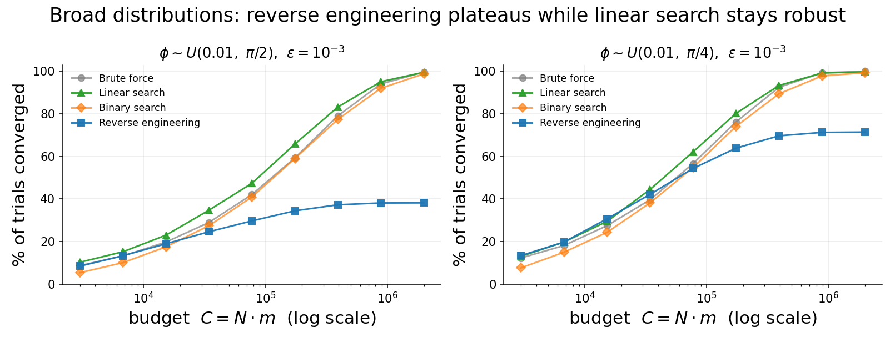

# Broad priors: linear search beats both the baseline and reverse engineering

Everywhere else in this work the prior is narrow and reverse engineering is the strongest adaptive
strategy. That is not the whole story. For a **broad uniform prior** whose upper end approaches the
ambiguity limit `π/2`, the ranking reverses: **linear search beats both the brute-force baseline and
reverse engineering**, because reverse engineering's depth inference breaks down.

All results below use the uniform prior `φ ~ U(0.01, φ_max)` with `ε = 10⁻³`; each number is the
de-biased best of a per-budget grid search (tuned on seed 42, validated on seed 2024, R = 30,000).

## Result — φ ~ U(0.01, π/2)

| budget `C = N·m` | Brute force | **Linear search** | Binary search | Reverse engineering |
|---:|---:|---:|---:|---:|
| 15,243 | 19.8% | **23.0%** | 17.5% | 19.0% |
| 77,459 | 42.1% | **47.4%** | 40.9% | 29.7% |
| 174,608 | 59.3% | **65.8%** | 59.0% | 34.4% |
| 393,597 | 79.0% | **83.2%** | 77.4% | 37.3% |
| 887,240 | 94.0% | **95.1%** | 92.0% | 38.1% |

**Linear search is the best algorithm at every budget** — it beats the baseline throughout and beats
reverse engineering by a widening margin. Reverse engineering **plateaus at ≈38 %** and never
improves, no matter how much budget it is given; linear search reaches ≈100 %, a gap of up to
**+61 pp**. (Binary search also overtakes reverse engineering once the budget is large enough, but it
only tracks the brute-force baseline, so linear search is the one that beats both.)

## Why reverse engineering fails here

Reverse engineering infers the circuit depth `N ≈ π/2φ̂` from a **single** estimate `φ̂` taken at the
minimum depth `N_min = ⌊π/2φ_max⌋`. When the prior reaches `π/2`, `N_min = 1`, so that first estimate
is extremely coarse. A small error in `φ̂` is amplified into a large error in the inferred `N`; the
protocol overshoots the optimal depth, the estimator aliases (`Nφ > π/2`), and those trials never
converge — capping the convergence rate regardless of budget. Linear search instead **walks `N`
upward** with an overshoot test, and binary search brackets it with a confidence bound, so both avoid
the catastrophic single-shot mistake and keep converging.

## How far the effect reaches

| prior | `N_min` | RE ceiling | linear reaches | linear − RE (max) |
|---|---:|---:|---:|---:|
| `U(0.01, π/2)` | 1 | ≈38 % | ≈100 % | +61 pp |
| `U(0.01, π/4)` | 2 | ≈71 % | ≈100 % | +28 pp |

The effect is strongest at `π/2` and fades as `φ_max` shrinks: a larger `N_min` gives reverse
engineering a more reliable first estimate, so it recovers and eventually wins again for the narrow
priors used elsewhere.

## Takeaway

The best adaptive strategy is **prior-dependent**, and this gives a clean regime map:

- **Narrow priors / high precision** → reverse engineering (large depth gain, reliable inference).
- **Broad dynamic ranges up to `π/2`** → linear search (robust to the coarse first estimate that
  defeats reverse engineering).

_Generated by `analysis/broad_dist_study.py` (`results/broad_dist.csv`, `results/fig_broad.png`)._
