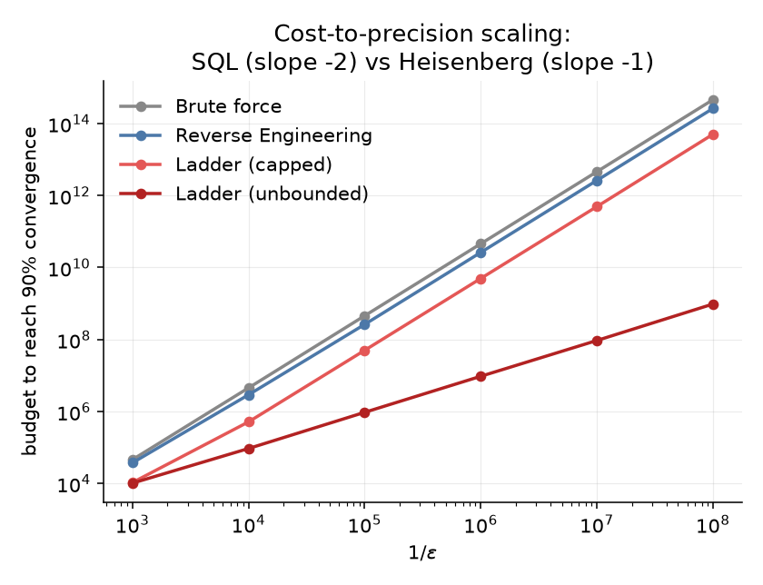

# LADDER — a phase-unwrapping protocol beyond Table 3.2

_Companion to `results/RESULTS.md`; nothing there is modified. Same fixed-budget methodology (tune on seed 42, validate the winning config on seed 2024 at **R = 50,000**), same budget-to-90%-crossing definition, so the columns below are directly comparable to Table 3.2. New algorithm and code live entirely under `ladder/` and read `qmetrology`/`results` read-only — see `ladder/algorithms.py` for the mechanism._

## Why a new protocol

Every algorithm in Table 3.2 — including reverse engineering — inverts a **single** batch via `phi_hat = arccos(sqrt(p_hat))/N`, which is unambiguous only while `N*phi < pi/2`. That caps the usable circuit depth at `N <= pi/(2*phi)`, so brute force AND every adaptive protocol scale as `error ~ 1/(2*sqrt(N*budget))` with `N` bounded: **cost-to-eps ~ 1/eps^2 for everyone**, and the adaptive/brute ratio saturates once both sides hit the same depth ceiling (the ~1.72× plateau reported in RESULTS.md — that plateau is the **invertibility cap**, not Heisenberg-limited saturation as currently phrased there).

The cap is informational, not physical. `cos^2(N phi)` only fixes `N*phi` up to the branch set `{+-arccos(sqrt(p_hat)) + k*pi}`; a *previous, coarser* estimate whose confidence interval is narrower than the branch spacing picks the right branch. So a **ladder** of measurements at geometrically deepening `N`, each unwrapped by the last estimate, can push `N` past `pi/(2 phi)` indefinitely — true Heisenberg scaling, `error ~ sqrt(m)/budget`, i.e. **cost-to-eps ~ 1/eps**. This is the standard Kitaev/Higgins iterative-phase-estimation idea (Kitaev quant-ph/9511026; Higgins et al., Nature 450, 393 (2007); Berry et al., PRA 80, 052114 (2009)), adapted to this thesis's circuit: since there is no controllable measurement phase, the ladder instead *steers the depth* so `N*phi_hat` lands on an odd multiple of `pi/4` — the point of maximal branch separation (`pi/2`) that also avoids the degenerate endpoints `p~0,1`.

Two variants are reported: **ladder (capped)** bounds `N <= pi/(2 phi_min)` — the same maximum depth the existing protocols already query, so it is the apples-to-apples 'same hardware' comparison, isolating the gain to the *inference*. **Ladder (unbounded)** lets depth grow freely — the information-theoretic ceiling, at the honest cost of an unboundedly large GHZ circuit as ε shrinks.

## Table L1 — budget to reach 90% convergence vs precision  (U(0.01, 0.1))

_Same definition as Table 3.2: sweep budget, report the log-interpolated crossing at 90%. Ratio = brute ÷ algorithm._

| Algorithm | eps=1e-3 | eps=1e-4 | eps=1e-5 | eps=1e-6 | eps=1e-7 | eps=1e-8 |
|---|---:|---:|---:|---:|---:|---:|
| Brute force | 45,577 | 4,488,957 | 452,409,668 | 45,352,578,488 | 4,555,306,158,375 | 455,387,972,051,628 |
| Reverse Engineering | 37,197 (×1.23) | 2,890,389 (×1.55) | 260,409,882 (×1.74) | 26,032,940,408 (×1.74) | 2,603,752,722,984 (×1.75) | 260,373,770,844,500 (×1.75) |
| Ladder (capped) | 10,541 (×4.32) | 510,851 (×8.79) | 49,637,604 (×9.11) | 4,921,622,475 (×9.21) | 488,619,603,160 (×9.32) | 49,876,430,857,104 (×9.13) |
| Ladder (unbounded) | 10,124 (×4.50) | 92,874 (×48.33) | 939,906 (×481.33) | 9,423,668 (×4812.62) | 93,031,533 (×48965.18) | 958,239,972 (×475233.75) |

## Table L1b — shifted range  U(0.001, 0.01), eps=1e-4

| Algorithm | budget to 90% |
|---|---:|
| Brute force | 440,167 |
| Reverse Engineering | 362,887 (×1.21) |
| Ladder (capped) | 101,389 (×4.34) |
| Ladder (unbounded) | 100,062 (×4.40) |

## Table L2 — % converged at fixed budget 10,000  (eps = 1e-3, U(0.01, 0.1))

_Table-3.1 operating point; ladder rows computed by `ladder/study.py::table31_check`._

| Algorithm | this work |
|---|---:|
| Brute force | 56.2% |
| Linear search | 56.6% |
| Binary search | 47.5% |
| Reverse Engineering | 60.3% |
| Ladder (capped) | 88.3% (CI 88.0-88.6) |
| Ladder (unbounded) | 89.2% (CI 88.9-89.4) |

## Unwrap-failure rate

_Fraction of trials landing more than 10·eps off, at the budget nearest each algorithm's own 90% crossing (a wrong-branch catastrophe, not ordinary estimator noise)._

| Setting | ladder (capped) | ladder (unbounded) |
|---|---:|---:|
| eps=1e-3 | 0.022% | 0.026% |
| eps=1e-4 | 0.048% | 0.038% |
| eps=1e-5 | 0.000% | 0.084% |
| eps=1e-6 | 0.002% | 0.096% |
| eps=1e-7 | 0.002% | 0.112% |
| eps=1e-8 | 0.002% | 0.140% |
| U(0.001,0.01), eps=1e-4 | 0.000% | 0.000% |

### Figure

## Mechanism & caveats

- **The RESULTS.md ~1.72× plateau is the invertibility cap, not Heisenberg-limited saturation.** Every existing algorithm is capped at N ~ pi/(2*phi); the ladder shows what happens once that cap is lifted by branch-unwrapping — the ratio keeps growing with precision instead of saturating (see Table L1 / the figure).

- **Ladder (capped) isolates the gain to inference**: same maximum depth as the existing protocols, so its multiple over reverse engineering is entirely due to sequential unwrapping (many cheap stages instead of one exploration + one exploitation shot), not to a bigger circuit.

- **Ladder (unbounded) is the information-theoretic ceiling, honestly**: its GHZ depth grows without bound as eps shrinks (see the per-stage N in `ladder/poc.py`'s traces) — a real device would cap it, which is exactly what the capped variant reports.

- **Unwrap failures are rare and controllable** via the `z`/`safety` margins (see table above); they trade off against growth rate (larger margins -> slower depth growth -> more stages -> closer to but never worse than the capped baseline).

## Methodology

- Same seeds as the rest of the project: SEED_TUNE=42 (R=2,000), SEED_TEST=2024 (R=50,000). Brute-force crossings recomputed here for self-consistency; cross-checked against `results/story_cube.csv` (agreement within ~1%, printed by `ladder/study.py`).

- Tuned grid: `m_stage in {50,100,200,400}`, `z in {2,2.5,3}`, `safety in {0.6,0.75,0.9}`, `final_frac in {0.3,0.5,0.7}` (see `ladder/study.py:GRID`).

- Regenerate: `python ladder/study.py` (~30-90 min) then `python ladder/make_results.py`.

