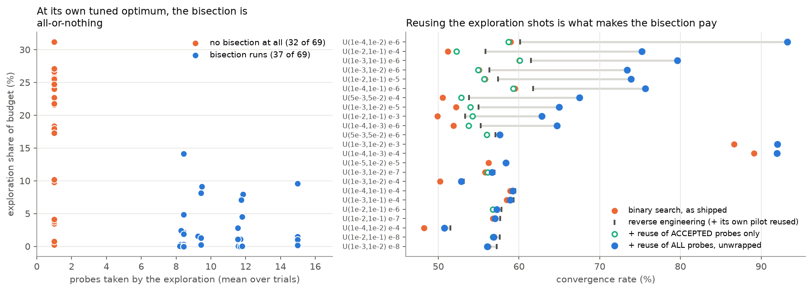

# Keeping the normal-law criterion: what is defensible, and what binary search can be

*Decision memo. Every claim below is a measurement; the script and sample size are named each time.
Equations are KaTeX — **Ctrl+Shift+V** for the VS Code preview.*

**Short version.** Keep the criterion. It is within **1.05× of the omniscient budget** (median, 90 %
threshold), which is a stronger justification than any derivation. Binary search collapsing into
reverse engineering is a **consequence** of that, not a defect, and it is reportable as a result.
There is exactly **one** change that makes binary search genuinely beat reverse engineering — reusing
the exploration shots in the final estimate — and it costs one new equation and a re-run of the binary
rows. Everything else I tested is worth ±1 pp.

---

## 1. The criterion is nearly optimal — this is the justification you are missing

Not "the approximation is reasonable", but: **measure the gap to the omniscient ceiling.** The thesis
already computes it (`oracle_hl` = `heisenberg_prob`, the non-degenerate ceiling of
`qmetrology/oracle.py`), so this costs no new simulation. Budget ratio, reverse engineering with the
statistical safeguard against the oracle, over the 23 scenarios of `results/story_curves.csv`:

| threshold | mean | **median** | worst |
|---|---:|---:|---:|
| 50 % | 1.98× | **1.10×** | 10.65× |
| 75 % | 1.47× | **1.08×** | 5.42× |
| 90 % | 1.28× | **1.05×** | 3.37× |
| 99 % | 1.18× | **1.03×** | 2.65× |

In **18 of 23** scenarios the safeguard is within **1.1×** of an algorithm that already knows
$\varphi$. In convergence-rate terms the median gap is **+0.74 pp**, and in 9 of 23 scenarios the
scenario-mean gap is ≤ 0.5 pp.

Both means are dominated by two scenarios only — and those are a tuning artifact, not a criterion
failure (§6.1). Fix that and the mean collapses toward the median.

**Write this as its own numerical-verification subsection.** It says something no derivation can: the
criterion cannot be improved much *because there is almost nothing left to take*. It simultaneously
justifies the criterion, bounds the posterior's value, and explains §3.

## 2. Approximate normality is not load-bearing — say so with a number

You are right that normality is neither required nor exactly true, and the honest framing is stronger
than a defence:

- **It is not an approximation of convenience.** $\operatorname{Var}(\hat\varphi)=1/(4N^{2}m)$ is the
  exact Cramér–Rao bound: the Fisher information is
  $I(\varphi) = \dfrac{N^{2}\sin^{2}(2N\varphi)}{\frac14\sin^{2}(2N\varphi)} = 4N^{2}$, constant in
  $\varphi$, and the estimator attains it. Full algebra in [POSTERIOR.md §4](POSTERIOR.md).
- **It is not exactly true**, and the failure mode is known and stated: $\hat\varphi$ is confined to
  $[0,\pi/2N]$ with atoms $P(\hat\varphi=\pi/2N)=(1-p_0)^m$ at the ends, so the law degrades once
  $m\,p_0\lesssim10$ (assumption A1/A7).
- **It does not matter here, measured.** Replacing it with the exact binomial posterior changes
  reverse engineering by **+0.06 pp** (paired, n = 54, `posterior_all_study.py`). Binary search
  +1.1 pp, linear search +4.9 pp — and both of those have the same single explanation (§5), which is
  the point you want to make anyway.

That is three sentences and one number, and it turns "we assume normality" into "we verified that
normality is not the binding constraint".

## 3. Why binary search collapses into reverse engineering — it is not the safeguard

Instrumented at binary search's **own tuned configuration**, 69 operating points across all 23
scenarios (`analysis/binary_diagnostics.py`, R = 15,000):

**The exploration is all-or-nothing.** At 46 % of operating points it takes exactly **1.00 probes** —
never a single bisection step, in any trial. At the other 54 % it takes a mean of **10.6**. There is
nothing in between.

Two separate mechanisms produce the 1-probe case, and only the first is fixable:

1. **The bisection cannot afford its own first step.** Algorithm 5 jumps to the *arithmetic* midpoint
   of $[N_{\min},N_{\max}]$. At $U(10^{-4},10^{-1})$ that is $N = 7861$ against $N_{\min}=15$, so the
   probe costs $m'\cdot 7861$ — more than the entire budget. The guard fires and the loop exits after
   the opening probe, having spent 1–2 % of the budget. Stepping to the **geometric** mean instead
   (one line, same overshoot test, same Eq. 3.8) revives it: 1.00 → 8.07 probes at that point.
2. **Even then, the tuner chooses one probe.** With geometric stepping the grid search raises $m'$
   until the second probe no longer fits. Forcing at least 3 probes costs **−13.2 pp on average**
   where the free optimum is one probe, and **0.0 pp** where the bisection already runs
   (`binary_geometric_study.py`, 50 points, R = 20,000).

So a one-probe exploration is not an accident — it is the optimum. And §1 says why: the depth decision
has ~1 pp of headroom in total, so *any* exploration costing more than about 1 % of the budget cannot
pay for itself.

## 4. Everything I tried that does not work

All keep Eq. (3.4) and Eq. (3.8) unchanged, all share one exploration per trial (paired), all tune
their own $m'$ and `conf`. Mean change vs. the shipped variant over 50 points, R = 20,000:

| variant | mean | median | note |
|---|---:|---:|---|
| pilot = deepest **accepted** probe | −0.29 | +0.03 | free but pointless |
| **geometric** step instead of arithmetic | −0.45 | −0.00 | makes the bisection *run*; does not make it *pay* |
| cap depth at $U$ (shallowest rejected) | −0.96 | −0.74 | the safe side of the bracket |
| cap depth at $L$ (deepest accepted) | −2.76 | −0.98 | $L$ aliases in ~20 % of trials |
| prior truncated to $(\pi/2U,\ \pi/2L)$ | −3.35 | −2.72 | worst of the lot |
| deepest probe **reflected** to $\pi/N-\hat\varphi$ | — | — | branch errors; 11.1 % vs 29.9 % at one point |
| sequential **phase unwrapping** as the pilot | ≈ 0 | ≈ 0 | works mechanically, buys nothing |

And at the **8 operating points with the largest oracle gap** — the only places where exploration could
possibly pay — every one of these arms is *numerically identical*, because the bisection takes 1.00
probes there (`binary_unwrap_study.py --top 8`, R = 15,000).

**Conclusion: no readout of the bisection's output can save the story.** The prize is capped at ~1 pp by
§1, and the exploration costs more than that.

## 5. The one thing that does work: stop throwing the exploration shots away

Every algorithm in Chapter 3 reports **only** the exploitation estimate. The exploration shots are spent
purely to choose $N$ and then discarded. They need not be.

A probe at depth $N$ reading $\hat\varphi$ is consistent with the ladder of phases

$$
\mathcal A_N(\hat\varphi) \;=\; \Big\{\, \tfrac{j\pi}{N} \pm \hat\varphi \;:\; j=0,1,2,\dots \Big\},
$$

of spacing $\pi/N$. A shallower probe already localises $\varphi$; if it localises it to better than
half that spacing, the correct element is simply the nearest one. Picking it costs one subtraction, and
the unwrapped value is an **unbiased estimate of $\varphi$ with spread $1/(2N\sqrt m)$ — Eq. (3.4),
unchanged**. Combining all of them with the exploitation estimate by inverse-variance weighting is then
elementary. The gate — unwrap probe $i$ only while $\pi/(2N_i\sigma) \ge z_{(1+\text{conf})/2}$ — reuses
the bisection's own confidence level, so **no new tuned constant appears**.

Measured, one budget per scenario, 23 points, each arm tuning its own $m'$ and `conf`, R = 12,000:

| | mean rate | vs. its own no-reuse version |
|---|---:|---:|
| reverse engineering | 59.58 | — |
| reverse engineering + reuse | 60.03 | +0.44 |
| binary search (shipped) | 57.87 | — |
| binary search + reuse of **accepted** probes only | 59.06 | +1.19 |
| **binary search + reuse of all probes, unwrapped** | **66.80** | **+8.94** |

and head to head, **binary search + reuse beats reverse engineering + reuse by +6.78 pp on average**
(median +0.15, wins 11 of 23, worst case −1.20).

Three things are worth understanding about that result:

- **Reuse refunds the exploration cost.** A probe contributes information $4N_i^2m'$ against the
  exploitation shot's $4NB'$, so an exploration costing a fraction $f$ of the budget returns roughly
  $f$ of the total information. Binary search's handicap — that it pays more for exploration —
  disappears.
- **The bisection's probes go *deeper than* $N_{\mathrm{opt}}$.** Exploitation is capped at the aliasing
  limit; the exploration is not. Unwrapping lets those deeper circuits count, which is exactly the
  mechanism by which phase-estimation ladders reach Heisenberg scaling, and it is why the gain is 9 pp
  and not 1 pp. It is *not* bounded by §1, because §1's ceiling assumes only the exploitation shot is
  reported.
- **Accepted-probes-only does not work** (−0.97 pp against RE+reuse, winning 1 of 23). The accepted
  probes are the shallow, low-information ones. The unwrapping identity is what unlocks it — the same
  lesson as the posterior, expressed inside the point-estimate framework you already have.

## 6. Three things to fix before you report anything

### 6.1 A tuning-grid defect that costs 47 pp

`analysis/extensive_sweep.py` tunes reverse engineering and binary search over
$m_{\text{exploration}} \ge 20$, but linear search over $\ge 3$. Where $N_{\min}$ is large relative to
the budget, the $m=20$ pilot consumes the budget by construction: at $U(10^{-4},10^{-3})$,
$\varepsilon=10^{-4}$, $B = 36{,}435$ it costs $20 \times 1570 = 31{,}400$ of $36{,}435$ — **86 % of the
budget on the pilot**. Lowering the floor to 3:

| scenario | reported | $m\ge20$ | $m\ge3$ | change |
|---|---:|---:|---:|---:|
| $U(10^{-4},10^{-3})$, $\varepsilon=10^{-4}$ | 28.06 | 28.29 | **76.00** | **+47.7** |
| $U(10^{-3},10^{-2})$, $\varepsilon=10^{-3}$ | 28.08 | 28.31 | **75.07** | **+46.8** |
| the other 21 scenarios | — | — | — | median −0.03 |

These two are exactly the scenarios carrying the 3.37× worst case in §1 and the 25 pp mean oracle gaps.
If the thesis says anywhere that brute force beats the adaptive methods at loose $\varepsilon$, **that
claim currently rests on a mis-tuned grid.**

### 6.2 Do not quote the exact oracle

I reproduced the degeneracy the repo documents: at $N = N_{\mathrm{opt}}$ the estimator returns
$\pi/(2N_{\mathrm{opt}})$, which *is* $\varphi$ to within $2\varphi^2/\pi$, so the exact oracle answers
from its own choice of $N$. At $U(10^{-4},10^{-2})$, $\varepsilon=10^{-4}$ it simulates at **99.82 %**
against an analytic **53.25 %**. `oracle_hl` is the right ceiling and the thesis already uses it — just
never let the exact one into a table without `degeneracy_share` beside it.

### 6.3 If you adopt reuse, `oracle_hl` stops being a ceiling

At $U(10^{-4},10^{-2})$, $\varepsilon=10^{-6}$, $B=4.6\times10^{8}$: `oracle_hl` = 60.67, binary search
+ reuse = **93.25**. That is not a contradiction — `heisenberg_prob` bounds algorithms that report only
the exploitation estimate — but the ceiling's definition would need one sentence of qualification, and
any "closes x % of the gap to what is achievable" phrasing would need rechecking.

### 6.4 A stale number

`results/binary_rescue.csv`'s `deep` column (−11.7 pp) does not reproduce: `binary_pilot_study.py`
(+0.02 pp) and this work (+0.03 pp median over 50 points) both say the deepest-accepted pilot is
performance-neutral. I have not found the cause. Do not cite that column.

## 7. The diagnostics you must report

From `results/binary_diagnostics.csv` — 69 operating points, 23 scenarios, R = 15,000, at each point's
own tuned configuration:

| metric | value |
|---|---|
| operating points where the exploration takes **1 probe** (no bisection at all) | **46 %** |
| operating points where it takes ≥ 4 probes | 54 % (mean 10.6 probes) |
| exploration share of budget | mean 8.9 %, median 3.8 %, max 31.2 % |
| exploitation depth $N^\star/N_{\mathrm{opt}}$ | mean 0.907, median 0.934, min 0.660 |
| trials landing within 5 % of $N_{\mathrm{opt}}$ | mean 55.7 % (range 6 – 100 %) |
| trials that alias ($N^\star > N_{\mathrm{opt}}$) | mean 0.50 %, max 5.97 % |
| $L/N_{\mathrm{opt}}$ when the bisection runs | 0.802 (vs 0.525 = $N_{\min}/N_{\mathrm{opt}}$ when it does not) |

The 46 % figure is the one an examiner will ask about, and it is much better to state it yourself with
the mechanism (§3) than to be asked. Stated well it *is* the result: the exploration is not doing a bad
job of bisecting, it is correctly declining to bisect.

## 8. Two options

**Option A — change nothing.** Add §1 as a numerical-verification subsection, §2 as three sentences,
§7 as a diagnostics table, and frame §3 as the finding:

> Binary search's exploration pays for itself only if its rejected probes can be used quantitatively.
> The overshoot criterion reduces each probe to a binary classification, and Eq. (3.8) already prices
> that risk from a single pilot, so the tuned optimum of Algorithm 5 is a one-probe exploration — that
> is, reverse engineering. Reverse engineering does not beat binary search; binary search *converges
> to it*. Recovering the discarded information requires the exact likelihood rather than the point
> estimate, which we leave to further work.

Cost: ~2 pages, no re-runs, no new equations. Result: a coherent thesis in which the collapse is the
conclusion. Risk: binary search never wins anything.

**Option B — Option A plus reuse.** Adds one equation ($\mathcal A_N$ and the inverse-variance
combination), turns the collapse into a two-act story — *the depth decision is saturated, so the
exploration is only worth its cost if the shots themselves are counted* — and binary search ends up
**+6.8 pp above reverse engineering** instead of 1.7 pp below it. Cost: re-run the binary rows,
requalify the ceiling (§6.3), ~4–5 pages. Both algorithms' numbers move.

**My recommendation: Option A, with §5 written up as a two-paragraph "further work" item alongside the
posterior**, sharing one sentence — *both fixes are the same fix: stop discarding the deep probes.*
That gets you a thesis where the negative result is explained rather than excused, the further-work
section is concrete and evidenced rather than speculative, and you finish. Take Option B only if you
have a clear two weeks and want binary search to win.

Either way, §6.1 is not optional.
