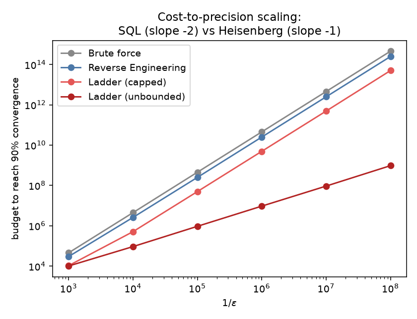

# LADDER — a phase-unwrapping protocol beyond the thesis

_Generated by `python analysis/ladder_study.py`. Same fixed-budget methodology as the thesis results (tune on seed 42, validate the winning config on seed 2024 at **R = 50,000**) and the same budget-to-90%-crossing definition, so these columns are directly comparable to the Chapter-4 tables. The algorithm is `qmetrology/ladder.py`; the thesis rows are read from `results/budget_crossings.csv`._

## Why a protocol outside the thesis family

Every Chapter-3 algorithm — reverse engineering included — inverts a **single** batch via `phi_hat = arccos(sqrt(p_hat))/N`, unambiguous only while `N*phi < pi/2`. That caps the usable circuit depth at `N <= pi/(2*phi)`, so brute force AND every adaptive protocol scale as `error ~ 1/(2*sqrt(N*budget))` with `N` bounded: **cost-to-eps ~ 1/eps² for everyone**, and the adaptive/brute ratio saturates once both sides hit the same depth ceiling. The plateau the thesis reports is that **invertibility cap**, not a physical Heisenberg limit.

The cap is informational. `cos²(N phi)` fixes `N*phi` only up to the branch set `{±arccos(sqrt(p_hat)) + k*pi}`; a *previous, coarser* estimate whose confidence interval is narrower than the branch spacing picks the right branch. A **ladder** of measurements at geometrically deepening `N`, each unwrapped by the last estimate, therefore pushes `N` past `pi/(2 phi)` indefinitely — Heisenberg scaling, **cost-to-eps ~ 1/eps**. This is the Kitaev/Higgins iterative-phase-estimation idea (Kitaev quant-ph/9511026; Higgins et al., Nature 450, 393 (2007); Berry et al., PRA 80, 052114 (2009)) adapted to this circuit: with no controllable measurement phase, the ladder *steers the depth* so `N*phi_hat` lands on an odd multiple of `pi/4` — maximal branch separation, away from the degenerate `p~0,1` ends.

**Ladder (capped)** bounds `N <= pi/(2 phi_min)`, the same maximum depth the thesis protocols already query, so it is the apples-to-apples comparison and isolates the gain to the *inference*. **Ladder (unbounded)** lets depth grow freely — the information-theoretic ceiling, at the honest cost of an unboundedly large GHZ circuit as ε shrinks.

## Table L1 — budget to reach 90% convergence vs precision  (U(0.01, 0.1))

_Ratio = brute ÷ algorithm._

| Algorithm | eps=1e-3 | eps=1e-4 | eps=1e-5 | eps=1e-6 | eps=1e-7 | eps=1e-8 |
|---|---:|---:|---:|---:|---:|---:|
| Brute force | 45,577 | 4,488,957 | 452,409,668 | 45,352,578,488 | 4,555,306,158,375 | 455,387,972,051,628 |
| Reverse Engineering | 29,800 (×1.53) | 2,600,000 (×1.73) | 251,000,000 (×1.80) | 25,100,000,000 (×1.81) | 2,490,000,000,000 (×1.83) | 248,000,000,000,000 (×1.84) |
| Ladder (capped) | 10,541 (×4.32) | 510,851 (×8.79) | 49,637,604 (×9.11) | 4,921,622,475 (×9.21) | 488,619,603,160 (×9.32) | 49,876,430,857,104 (×9.13) |
| Ladder (unbounded) | 10,124 (×4.50) | 92,874 (×48.33) | 939,906 (×481.33) | 9,423,668 (×4812.62) | 93,031,533 (×48965.18) | 958,239,972 (×475233.75) |

## Table L1b — shifted range  U(0.001, 0.01), eps=1e-4

| Algorithm | budget to 90% |
|---|---:|
| Brute force | 440,167 |
| Reverse Engineering | 303,000 (×1.45) |
| Ladder (capped) | 101,389 (×4.34) |
| Ladder (unbounded) | 100,062 (×4.40) |

## Table L2 — % converged at fixed budget 10,000  (eps = 1e-3, U(0.01, 0.1))

_The Table-3.1 operating point. The thesis rows are read from `results/performance_curves.csv`, the ladder rows are computed here._

| Algorithm | this work |
|---|---:|
| Brute force | 56.1% |
| Linear search | 64.1% |
| Binary search | 65.1% |
| Reverse Engineering | 66.3% |
| Separable (N=1) | 15.7% |
| Ladder (capped) | 88.3% (CI 88.0–88.6) |
| Ladder (unbounded) | 89.2% (CI 88.9–89.4) |

## Unwrap-failure rate

_Fraction of trials landing more than 10·eps off, at the budget nearest each algorithm's own 90% crossing — a wrong-branch catastrophe, not estimator noise._

| Setting | ladder (capped) | ladder (unbounded) |
|---|---:|---:|
| eps=1e-3 | 0.022% | 0.026% |
| eps=1e-4 | 0.048% | 0.038% |
| eps=1e-5 | 0.000% | 0.084% |
| eps=1e-6 | 0.002% | 0.096% |
| eps=1e-7 | 0.002% | 0.112% |
| eps=1e-8 | 0.002% | 0.140% |
| U(0.001,0.01), eps=1e-4 | 0.000% | 0.000% |

### Figure

## Mechanism & caveats

- **The thesis plateau is the invertibility cap**, not Heisenberg-limited saturation. Every Chapter-3 algorithm is capped at `N ~ pi/(2*phi)`; once branch-unwrapping lifts the cap the ratio keeps growing with precision (Table L1 and the figure).

- **Ladder (capped) isolates the gain to inference**: same maximum depth as the thesis protocols, so its margin over reverse engineering is due entirely to sequential unwrapping — many cheap stages instead of one exploration plus one exploitation batch.

- **Ladder (unbounded) is the ceiling, honestly**: its GHZ depth grows without bound as eps shrinks. A real device would cap it, which is what the capped variant reports.

- **Unwrap failures are rare and controllable** via the `z`/`safety` margins (table above); they trade against growth rate — larger margins mean slower depth growth and more stages, approaching but never falling below the capped baseline.

- Tuned grid: `m_stage in [50, 100, 200, 400]`, `z in [2.0, 2.5, 3.0]`, `safety in [0.6, 0.75, 0.9]`, `final_frac in [0.3, 0.5, 0.7]`.

