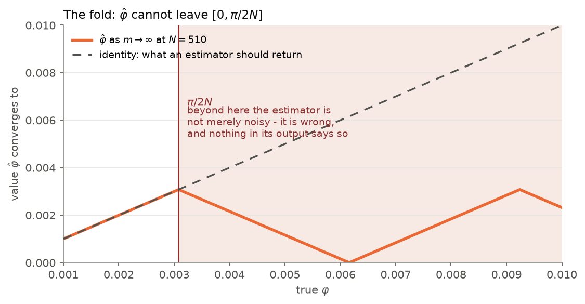
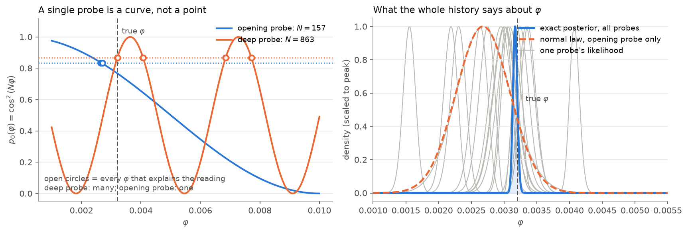
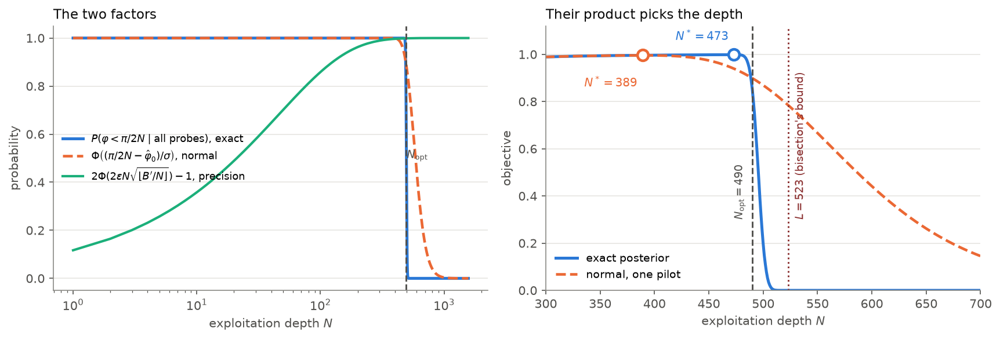
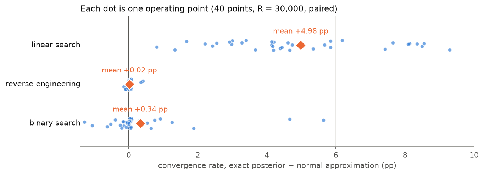
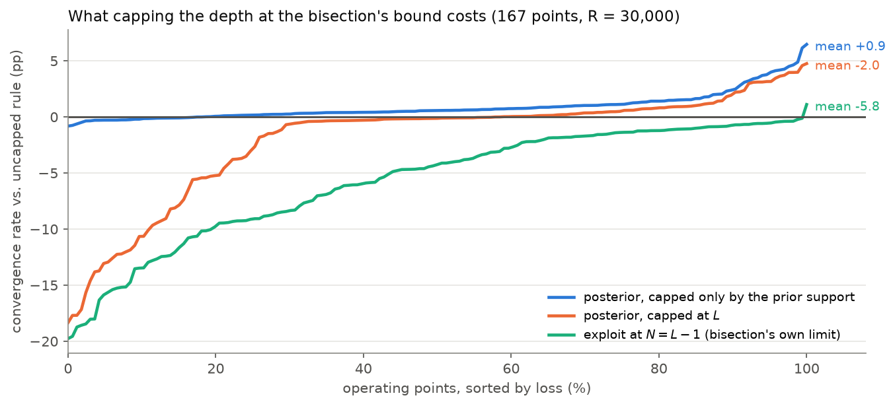

# The exact-posterior depth criterion — full derivation

*Implementation: `qmetrology/posterior.py`. Figures and every number quoted here:
`python analysis/posterior_explain.py` (figures), plus `grid_resolution_check()`, `posterior_sharpness()`
and `worked_example()` in the same file.*

*Equations are `$…$` / `$$…$$` KaTeX. In VS Code press **Ctrl+Shift+V** for the Markdown preview; the math
renders there natively. It will not render in a plain terminal `cat`.*

**Contents**

1. [What changed, in one paragraph](#1-what-changed-in-one-paragraph)
2. [The measurement model](#2-the-measurement-model)
3. [The estimator and the fold it applies](#3-the-estimator-and-the-fold-it-applies)
4. [The sampling law of $\hat\varphi$, derived twice](#4-the-sampling-law-of-hatvarphi-derived-twice)
5. [The old first factor, written out](#5-the-old-first-factor-written-out)
6. [The exact posterior](#6-the-exact-posterior)
7. [Identifiability: why the product has one mode](#7-identifiability-why-the-product-has-one-mode)
8. [The criterion, assembled](#8-the-criterion-assembled)
9. [Which assumption does what](#9-which-assumption-does-what)
10. [A worked example, probe by probe](#10-a-worked-example-probe-by-probe)
11. [What it buys](#11-what-it-buys)
12. [Where it is still approximate](#12-where-it-is-still-approximate)
13. [The related question: capping the depth at the bisection's bound](#13-the-related-question-capping-the-depth-at-the-bisections-bound)

---

## 1. What changed, in one paragraph

Eq. (3.8) picks the exploitation depth as

$$
N^{\star} \;=\; \arg\max_{1\le N\le N_{\max}}\;
\underbrace{P\!\left(\varphi < \tfrac{\pi}{2N}\right)}_{\text{factor A: do not alias}}
\;\times\;
\underbrace{\Big[\,2\Phi\!\big(2\varepsilon\sqrt{N B'}\,\big)-1\,\Big]}_{\text{factor B: be precise enough}}
\tag{1}
$$

and **nothing about that changed**. What changed is how **factor A** is computed. The old route turns
*one* probe into a point estimate $\hat\varphi_0$ and evaluates factor A as a Gaussian tail. The new route
computes it as an integral of the **exact binomial posterior over every probe the exploration took**,
including the probes the overshoot test rejected. Same objective; factor A goes from an asymptotic
approximation of one data point to an exact statement about all of them.

Everything below is the explicit version of that sentence.

---

## 2. The measurement model

The circuit at depth $N$ prepares a state that reads out `0` with probability

$$
p_0(\varphi) \;=\; \cos^2(N\varphi).
\tag{2}
$$

Drawing $m$ independent shots and counting the `0`s gives

$$
k \;\sim\; \mathrm{Binomial}\big(m,\;p_0(\varphi)\big),
\qquad
P(k\mid\varphi) \;=\; \binom{m}{k}\,\cos^{2k}(N\varphi)\,\big[1-\cos^{2}(N\varphi)\big]^{\,m-k}.
\tag{3}
$$

This is the **entire** content of one probe. $(N,k,m)$ is a sufficient statistic — there is nothing else
in the shot record that depends on $\varphi$. Two facts about (3) matter and are used repeatedly:

- it is **exactly** true for every $\varphi$, with no restriction on $N\varphi$;
- $p_0$ is **not injective** in $\varphi$ — $\cos^2$ has period $\pi/N$ in $\varphi$ and is symmetric about
  each multiple of $\pi/(2N)$.

The second fact is where every difficulty in this section comes from.

---

## 3. The estimator and the fold it applies

### 3.1 Definition

The thesis inverts (2) at the observed frequency $\hat p_0 = k/m$:

$$
\hat\varphi \;=\; \frac{1}{N}\arccos\sqrt{k/m}\,.
\tag{4}
$$

Since $\arccos:[0,1]\to[0,\pi/2]$, we have immediately

$$
\hat\varphi \;\in\; \Big[0,\;\frac{\pi}{2N}\Big] \quad\text{always, for every possible data set.}
\tag{5}
$$

### 3.2 What (4) converges to

Take $m\to\infty$ so $k/m \to \cos^2(N\varphi)$ and write $\theta = N\varphi$. Then

$$
\hat\varphi \;\longrightarrow\; \frac{1}{N}\arccos\sqrt{\cos^{2}\theta} \;=\; \frac{1}{N}\arccos\big|\cos\theta\big| .
$$

Evaluate $\arccos|\cos\theta|$ explicitly. For $\theta\in[0,\pi/2]$, $|\cos\theta| = \cos\theta$ and
$\arccos(\cos\theta)=\theta$. For $\theta\in[\pi/2,\pi]$, $|\cos\theta| = -\cos\theta = \cos(\pi-\theta)$
with $\pi-\theta\in[0,\pi/2]$, so $\arccos|\cos\theta| = \pi-\theta$. Both branches, and their periodic
continuation, are summarised by the **distance to the nearest multiple of $\pi$**:

$$
\arccos\big|\cos\theta\big| \;=\; d(\theta) \;:=\; \min_{j\in\mathbb Z}\big|\theta - j\pi\big|
\;=\; \Big|\big((\theta + \tfrac{\pi}{2}) \bmod \pi\big) - \tfrac{\pi}{2}\Big| .
\tag{6}
$$

So the noiseless estimator returns

$$
\tilde\varphi(\varphi) \;=\; \frac{d(N\varphi)}{N}
\;=\;
\begin{cases}
\varphi, & 0\le \varphi \le \dfrac{\pi}{2N} \quad\text{(no overshoot)},\\[2mm]
\dfrac{\pi}{N}-\varphi, & \dfrac{\pi}{2N}\le \varphi \le \dfrac{\pi}{N},\\[2mm]
\varphi - \dfrac{\pi}{N}, & \dfrac{\pi}{N}\le \varphi \le \dfrac{3\pi}{2N}, \quad\text{etc.}
\end{cases}
\tag{7}
$$

Define $N_{\mathrm{opt}} = \lfloor \pi/(2\varphi)\rfloor$, the deepest circuit for which no fold occurs.
Equation (7) says: **for $N > N_{\mathrm{opt}}$ the estimator is not noisy, it is wrong** — it converges to
a reflected value — **and its output carries no marker of that.** A reading of $\hat\varphi = 0.0030$ is
consistent with $\varphi = 0.0030$ and with $\varphi = \pi/N - 0.0030$, and (4) always reports the first.

This is the *only* reason the overshoot test (Eqs. 3.4–3.5) exists, and its only possible response is to
**discard** the probe: once $\hat\varphi$ has been formed, the information about which branch produced it
is gone.

### 3.3 The information that gets discarded with it

Consider the extreme case $k=0$ at depth $N$. Then $\hat\varphi = \arccos(0)/N = \pi/(2N)$ — the estimator
saturates at the top of its range (5), which is exactly the reading the overshoot test flags. But the
*likelihood* of that observation is

$$
P(k=0\mid\varphi) \;=\; \big[1-\cos^{2}(N\varphi)\big]^{m} \;=\; \sin^{2m}(N\varphi),
\tag{8}
$$

which is sharply peaked at $N\varphi = \pi/2$. Substituting $\delta = \pi/2 - N\varphi$ and using
$\sin(N\varphi) = \cos\delta$ and $\log\cos\delta = -\tfrac{\delta^2}{2} - \tfrac{\delta^4}{12} - \dots$:

$$
\log P \;=\; 2m\log\cos\delta \;=\; -m\,\delta^{2} + O(m\delta^4),
$$

i.e. a Gaussian ridge in $\delta$ with

$$
\mathrm{sd}(\delta) = \frac{1}{\sqrt{2m}}
\qquad\Longrightarrow\qquad
\mathrm{sd}(\varphi) \;=\; \frac{1}{N\sqrt{2m}}.
\tag{9}
$$

Compare with the sampling spread of a *non*-overshooting probe, $1/(2N\sqrt m)$ from §4. At the *same*
$(N,m)$ the ridge is actually $\sqrt2$ times **wider** — the sharpness does not come from the $k=0$
reading being intrinsically better. It comes from **where these probes sit**: both widths scale as
$1/N$, and a bisection only produces $k\approx0$ readings at depths near $N_{\mathrm{opt}}$, which is far
deeper than the shallow probes the overshoot test accepts. In the worked example of §10 the opening probe
has spread $4.1\times10^{-4}$ while the rejected $k=0$ probes at $N\approx520$ have ridges of width
$\tfrac{1}{520\sqrt{120}} = 1.8\times10^{-4}$, and there are four of them. **The probes the overshoot test
throws away are the sharpest statements the exploration produces**, not because of the reading but
because of the depth. That is the whole opportunity.

---

## 4. The sampling law of $\hat\varphi$, derived twice

Both routes need this, so it is worth having exactly. Assume no fold, $\varphi < \pi/2N$.

### 4.1 Delta method

Write $\hat\varphi = g(\hat p_0)$ with $g(p) = \arccos(\sqrt p)/N$ and $\hat p_0 = k/m$, so
$\operatorname{Var}(\hat p_0) = p_0(1-p_0)/m$. Differentiate, with $u=\sqrt p$:

$$
\frac{\mathrm d}{\mathrm dp}\arccos\sqrt p
\;=\;\frac{\mathrm d\arccos u}{\mathrm du}\cdot\frac{\mathrm du}{\mathrm dp}
\;=\;\left(\frac{-1}{\sqrt{1-u^{2}}}\right)\left(\frac{1}{2\sqrt p}\right)
\;=\;\frac{-1}{2\sqrt{p(1-p)}},
$$

hence $g'(p) = -\dfrac{1}{2N\sqrt{p(1-p)}}$ and

$$
\operatorname{Var}(\hat\varphi)\;\approx\; \big[g'(p_0)\big]^{2}\operatorname{Var}(\hat p_0)
\;=\;\frac{1}{4N^{2}\,p_0(1-p_0)}\cdot\frac{p_0(1-p_0)}{m}
\;=\;\boxed{\;\frac{1}{4N^{2}m}\;}
\tag{10}
$$

The $p_0(1-p_0)$ factors **cancel exactly**. This is why the variance does not depend on $\varphi$, and
that constancy is what the whole normal-approximation route rests on.

### 4.2 Fisher information (confirms it is not an accident)

For a single shot, $I(\varphi) = \dfrac{[p_0'(\varphi)]^{2}}{p_0(\varphi)\,[1-p_0(\varphi)]}$. With
$p_0 = \cos^2(N\varphi)$:

$$
p_0'(\varphi) = -2N\cos(N\varphi)\sin(N\varphi) = -N\sin(2N\varphi),
\qquad
p_0(1-p_0) = \cos^2(N\varphi)\sin^2(N\varphi) = \tfrac14\sin^{2}(2N\varphi),
$$

so

$$
I(\varphi) \;=\; \frac{N^{2}\sin^{2}(2N\varphi)}{\tfrac14\sin^{2}(2N\varphi)} \;=\; 4N^{2},
\qquad
I_m(\varphi) = 4N^{2}m,
\qquad
\mathrm{CRB} = \frac{1}{4N^{2}m}.
\tag{11}
$$

Constant in $\varphi$, and equal to (10): the estimator is asymptotically efficient. Writing $\sigma$ for
its standard deviation,

$$
\sigma(N,m) \;=\; \frac{1}{2N\sqrt m}.
\tag{12}
$$

### 4.3 Where (10)–(12) stop being true

Three explicit failure modes, all of which the exact posterior avoids and factor B still inherits:

1. **The fold.** For $\varphi > \pi/2N$, $\hat\varphi$ is not centred on $\varphi$ at all but on
   $\tilde\varphi(\varphi)$ from (7). The law $\mathcal N(\varphi,\sigma^2)$ is not approximately wrong,
   it is describing a different quantity.
2. **Boundary censoring.** $\hat\varphi$ lives on $[0,\pi/2N]$, so its distribution has atoms at both
   ends: $P(\hat\varphi = \pi/2N) = P(k=0) = (1-p_0)^m$ and $P(\hat\varphi=0) = P(k=m) = p_0^m$. When
   $m\,p_0 \lesssim 10$ or $m(1-p_0)\lesssim 10$ these atoms carry real mass and no continuous
   approximation is valid. This is assumption **A1**'s stated validity region.
3. **$\sin(2N\varphi)\to 0$.** At $N\varphi$ near $0$ or $\pi/2$ both numerator and denominator of (11)
   vanish; the ratio has the constant limit $4N^2$, but the delta-method expansion around $p_0$ needs
   $\hat p_0$ to stay away from $\{0,1\}$, which is failure mode 2 again.

---

## 5. The old first factor, written out

The pilot is one probe $(N_0, k_0, m')$, giving $\hat\varphi_0$ by (4) and $\sigma_0 = 1/(2N_0\sqrt{m'})$
by (12). Read (10) as a likelihood in $\varphi$ and combine with the uniform prior of **A3**:

$$
\varphi \mid \hat\varphi_0 \;\sim\; \mathcal N(\hat\varphi_0,\ \sigma_0^{2})
\ \text{ truncated to }[\varphi_{\min},\varphi_{\max}].
$$

Dropping the truncation (**A4**) gives the shipped form,

$$
P\!\left(\varphi<\tfrac{\pi}{2N}\right)
\;=\;\Phi\!\left(\frac{\pi/(2N)-\hat\varphi_0}{\sigma_0}\right),
\tag{13}
$$

and keeping it gives the exact conditional (`support=` in `safeguard.py::_p_safe`),

$$
P\!\left(\varphi<\tfrac{\pi}{2N}\right)
\;=\;
\frac{\Phi\!\big((\pi/2N-\hat\varphi_0)/\sigma_0\big)-\Phi\!\big((\varphi_{\min}-\hat\varphi_0)/\sigma_0\big)}
     {\Phi\!\big((\varphi_{\max}-\hat\varphi_0)/\sigma_0\big)-\Phi\!\big((\varphi_{\min}-\hat\varphi_0)/\sigma_0\big)} .
\tag{14}
$$

`analysis/truncation_check.py` measures the difference between (13) and (14) as $\le 0.14$ pp of
convergence (SE 0.25 pp) at every reported operating point, because the prior spans
$\pi\sqrt{m'}\,(1-\varphi_{\min}/\varphi_{\max}) \ge 14\,\sigma_0$ there.

**Why this route cannot use more than one probe.** Suppose you have $K$ probes and want to pool them.
Inverse-variance pooling requires each $\hat\varphi_i$ to be an unbiased estimate of the *same* $\varphi$.
By (7) that holds only for probes with $N_i \le N_{\mathrm{opt}}$, which is precisely the quantity you do
not know — it is what you are trying to bound. Restricting the pool to probes the overshoot test accepted
does not fix it either: acceptance is the event $\hat\varphi_i \ge \varphi_1$, so the surviving estimates
are **selected for reading high** (measured selection bias $0.40\sigma$ for the deepest accepted probe,
against $0.04\sigma$ for the opening probe — `results/THESIS_CHANGES.md` §9e). Under the normal
approximation the two honest options are "use one probe chosen a priori" or "model the fold". The
posterior takes the second.

---

## 6. The exact posterior

### 6.1 Bayes, explicitly

Let the exploration produce $K$ probes $\mathcal D = \{(N_i,k_i)\}_{i=1}^{K}$, all with $m$ shots, and let
the prior be uniform on the support (**A3** — literally how `experiments.py` draws $\varphi$):

$$
p(\varphi) \;=\; \frac{\mathbb 1\{\varphi_{\min}\le\varphi\le\varphi_{\max}\}}{\varphi_{\max}-\varphi_{\min}} .
$$

The probes are conditionally independent given $\varphi$ (independent shots on independently prepared
circuits), so

$$
p(\varphi\mid\mathcal D)
\;=\;\frac{p(\varphi)\prod_{i=1}^{K}\binom{m}{k_i}\cos^{2k_i}(N_i\varphi)\big[1-\cos^{2}(N_i\varphi)\big]^{m-k_i}}
{\displaystyle\int_{\varphi_{\min}}^{\varphi_{\max}}\!\!p(\varphi')\prod_{i=1}^{K}\binom{m}{k_i}\cos^{2k_i}(N_i\varphi')\big[1-\cos^{2}(N_i\varphi')\big]^{m-k_i}\,\mathrm d\varphi'} .
$$

The binomial coefficients and the constant prior density are free of $\varphi$ and cancel between
numerator and denominator, leaving

$$
\boxed{\;
p(\varphi\mid\mathcal D)\;\propto\;\prod_{i=1}^{K}\cos^{2k_i}(N_i\varphi)\,\big[1-\cos^{2}(N_i\varphi)\big]^{\,m-k_i},
\qquad \varphi\in[\varphi_{\min},\varphi_{\max}].
\;}
\tag{15}
$$

Note what is **not** assumed here: no asymptotics in $m$, no restriction $N_i\varphi<\pi/2$, no
independence of $\hat\varphi_i$ across probes, no unbiasedness. Equation (3) is exact for every probe
whether it aliased or not, so (15) is exact.

*(A caveat that is real but small: the bisection chooses $N_{i+1}$ from $k_1,\dots,k_i$. For a likelihood
this is harmless — the depths are an ancillary sequential design and the design terms cancel from the
posterior in exactly the way the binomial coefficients do. It matters only for factor B, §12.3.)*

### 6.2 Log form and numerics

`log_likelihood` accumulates

$$
\ell(\varphi) \;=\; \sum_{i=1}^{K}\Big[\,k_i\log p_{0,i}(\varphi) \;+\; (m-k_i)\log\big(1-p_{0,i}(\varphi)\big)\Big],
\qquad p_{0,i}(\varphi)=\cos^2(N_i\varphi),
\tag{16}
$$

evaluated as `hits*log(p0 + 1e-300) + (m-hits)*log1p(-p0 + 1e-300)`. Three deliberate details:

- **the $10^{-300}$ floor.** $p_0$ hits exactly $0$ or $1$ at grid points where $N_i\varphi$ is a multiple
  of $\pi/2$. Without the floor those terms are $-\infty$ and any $\varphi$ that any single probe rules
  out absolutely is lost to `nan`. With it, the worst any one term can contribute is
  $\log(10^{-300})\approx-690.8$ — a finite, overwhelming, but recoverable penalty.
- **`log1p`** rather than `log(1-p0)`: for $p_0$ near $1$ (shallow probes at small $\varphi$, the RE
  regime) `1-p0` loses all its significant digits in double precision, while `log1p(-p0)` does not.
- **max-subtraction before exponentiating.** $\ell$ routinely reaches $-10^{4}$; `posterior` computes
  $w \propto \exp(\ell - \max\ell)$, so the largest weight is exactly $1$ and nothing underflows to a
  degenerate all-zero vector. If the sum still comes out non-finite or zero the function falls back to
  the uniform prior, which makes the criterion degrade to "the prior support says nothing", not crash.

### 6.3 The grid, and why a uniform one is the right default

`phi_grid` lays down $n = 4096$ equally spaced points

$$
\varphi_j = \varphi_{\min} + j\,\Delta,\qquad
\Delta = \frac{\varphi_{\max}-\varphi_{\min}}{n-1},\qquad j = 0,\dots,n-1,
$$

and `posterior` returns the normalised weights $w_j = e^{\ell(\varphi_j)}/\sum_l e^{\ell(\varphi_l)}$.
These $w_j$ are the **rectangle-rule quadrature of the posterior probability of cell $j$**: the exact
cell probability is $p(\varphi_j\mid\mathcal D)\Delta \big/ \sum_l p(\varphi_l\mid\mathcal D)\Delta$, and
because $\Delta$ is the same in every cell it cancels. That cancellation is the only reason a bare
`exp(ℓ)/sum(exp(ℓ))` is a valid probability vector — **a non-uniform grid would need an explicit
$\Delta_j$ weight**, which matters in §12.1.

The cumulative sum then gives factor A directly. For a threshold $t = \pi/(2N)$,

$$
P\!\left(\varphi<\tfrac{\pi}{2N}\;\Big|\;\mathcal D\right)
\;\approx\;\sum_{j\,:\,\varphi_j < t} w_j
\;=\;\mathrm{cdf}\big[\,\jmath(N)\,\big],
\qquad
\jmath(N) = \max\{\,j : \varphi_j < t\,\},
\tag{17}
$$

with the two boundary conventions the code makes explicit: $\jmath(N)<0$ (the whole support is above the
threshold) gives $0$, and $t \ge \varphi_{n-1}$ (the whole support is below it) gives $1$.

**Cost.** $O(K n)$ for (16) — $K\approx 8\!-\!12$ probes $\times$ 4096 points, once per trial, after the
exploration has finished. No extra shots are taken, so budget accounting is untouched.

---

## 7. Identifiability: why the product has one mode

A single deep probe cannot pin $\varphi$ down. Solve $p_{0}(\varphi')=p_{0}(\varphi)$ exactly:

$$
\cos^{2}(N\varphi')=\cos^{2}(N\varphi)
\iff \cos(2N\varphi')=\cos(2N\varphi)
\iff 2N\varphi' = \pm 2N\varphi + 2\pi j,
$$

so the set of observationally equivalent phases is

$$
\mathcal A_N(\varphi) \;=\; \Big\{\,\pm\varphi + \tfrac{\pi j}{N}\ :\ j\in\mathbb Z\,\Big\},
\tag{18}
$$

two interleaved arithmetic progressions of spacing $\pi/N$. Those are the extra grey humps in the right
panel of figure 1 below, and the extra teeth of the sawtooth in figure 0.

The opening probe removes them. By construction

$$
N_{\min} \;=\; \Big\lfloor \frac{\pi}{2\varphi_{\max}} \Big\rfloor
\qquad\Longrightarrow\qquad
N_{\min}\,\varphi \;\le\; \frac{\pi}{2\varphi_{\max}}\cdot\varphi_{\max} \;=\; \frac{\pi}{2}
\quad\text{for every }\varphi\le\varphi_{\max}.
\tag{19}
$$

So on the whole prior support $N_{\min}\varphi$ stays inside $[0,\pi/2]$, where $\cos^2$ is strictly
decreasing and therefore injective. Consequences, both exact:

- $\mathcal A_{N_{\min}}(\varphi)\cap[\varphi_{\min},\varphi_{\max}] = \{\varphi\}$ — the opening probe's
  likelihood has a single mode over the support;
- since $\varphi\mapsto p_{0}$ is a strict bijection there and the binomial likelihood
  $p^{k}(1-p)^{m-k}$ is unimodal in $p$ with its mode at $p=k/m$, the composition is unimodal in
  $\varphi$, with its mode exactly at $\hat\varphi$ of (4).

That is what **A2** asserts, and (19) is a proof of it for reverse engineering and for the *opening*
probe of a bisection. It is **not** a proof for the deepest accepted probe of a bisection, which is why
`safeguard.py` documents A2 as "weaker for binary search": there it is the overshoot test, a statistical
procedure with a type-I error rate, that rules out the aliased branch, not an inequality.

In the product (15) the aliased branches of the deep probes get multiplied by the opening probe's
likelihood, which is small there, and vanish. This is why the posterior can safely use probes that are
individually ambiguous: **the multimodality is per-probe, the product is not.**

*Left*: the two readings of §3 as curves. The opening probe at $N=157$ crosses its observed frequency
once over the support (equation 19); the deep probe at $N=863$ crosses it four times (equation 18).
`arccos` must pick a branch and always picks the leftmost.

*Right*: the same trial's likelihoods. Grey = individual probes, several visibly multimodal. Blue =
their product (15). Orange dashed = the normal law (13) from the opening probe alone. Measured over 400
trials at this operating point, the posterior's sd is **8.2× tighter** than the pilot's (10th–90th
percentile 7.0×–16.4×), and both are calibrated: a 2-sd interval covers the true $\varphi$ 94.0 % of the
time for the posterior and 94.5 % for the pilot.

---

## 8. The criterion, assembled

### 8.1 Factor B, derived

The exploitation stage spends the remaining budget $B'$ on one circuit of depth $N$, so it can afford

$$
m \;=\; \Big\lfloor \frac{B'}{N} \Big\rfloor \quad\text{shots.}
$$

Its estimate is fresh data at a depth chosen before it was taken, so **A1** applies with (12):
$\hat\varphi\sim\mathcal N(\varphi,\ \sigma^2)$, $\sigma = 1/(2N\sqrt m)$. The trial converges iff
$|\hat\varphi-\varphi|<\varepsilon$, so with $Z\sim\mathcal N(0,1)$

$$
P(\text{converge}\mid N)
= P\!\left(|Z| < \frac{\varepsilon}{\sigma}\right)
= 2\Phi\!\left(\frac{\varepsilon}{\sigma}\right)-1
= 2\Phi\big(2\varepsilon N\sqrt m\big)-1
= 2\Phi\big(2\varepsilon\sqrt{N^{2}m}\big)-1 .
$$

Now substitute $m$. Exactly, $N^{2}m = N^{2}\lfloor B'/N\rfloor \ge N B' - N^{2}$, so dropping the floor
gives $N^{2}m \approx N B'$ with relative error at most

$$
\frac{N^{2}}{N B'} \;=\; \frac{N}{B'} \;\approx\; \frac{1}{m},
$$

i.e. the approximation is exactly as good as the exploitation stage is well-resourced. At $m\ge100$ it is
below 1 % (and enters the objective through a square root, so below 0.5 % there). It is only material in
the extreme low-budget corner where the exploitation stage can afford $m = O(10)$ shots — the same corner
where **A7** already fails. Hence

$$
P(\text{converge}\mid N) \;=\; 2\Phi\big(2\varepsilon\sqrt{N B'}\big)-1 .
\tag{20}
$$

**Depth is what buys precision**: $\sigma \propto 1/(N\sqrt m) = 1/\sqrt{N^2 m} = 1/\sqrt{NB'}$, so at a
fixed budget a circuit twice as deep is $\sqrt 2$ times more precise. That is the entire reason to want
large $N$, and the reason aliasing has to be traded against rather than simply avoided.

### 8.2 Monotonicity and the shape of the objective

Let $F(\cdot\mid\mathcal D)$ be the posterior CDF and write the objective of (1) as
$S(N) = A(N)\,C(N)$, where $A(N) = F(\pi/2N\mid\mathcal D)$ is factor A and $C(N)$ is factor B from (20).
(The letter $C$ avoids a collision with the budget $B'$.)

- $C$ is **strictly increasing**: $N\mapsto 2\varepsilon\sqrt{NB'}$ is strictly increasing and $\Phi$ is
  strictly increasing.
- $A$ is **non-increasing**: $N\mapsto\pi/2N$ is strictly decreasing and a CDF is non-decreasing, so the
  composition is non-increasing.

So the two factors genuinely pull against each other and the maximiser is interior in general. But note
what is *not* claimed: $S$ is **not** guaranteed unimodal. $A$ computed by (17) is a step function of
$N$, and even in the smooth case (13) the product of a Gaussian tail and a Gaussian-difference is not
log-concave in $N$ in general. The two implementations differ here, and the difference is worth being
explicit about:

| | how the argmax is taken | exact? |
|---|---|---|
| `posterior.py::depth_from_posterior` | evaluates $S$ at **every** integer $N=1,\dots,N_{\max}$ and takes `argmax` | **yes**, exact argmax over the admissible integers |
| `safeguard.py::risk_optimal_depth` | evaluates $S$ at **every** integer $N=N_{\min},\dots,N_{\max}$ and takes `argmax` | **yes**, exact argmax over the admissible integers — and no unimodality is assumed |

### 8.3 The upper limit $N_{\max}$

The default cap is $N_{\max} = \lfloor\pi/(2\varphi_{\min})\rfloor$, and it is **not** an approximation.
For $N > \pi/(2\varphi_{\min})$ we have $\pi/(2N) < \varphi_{\min}$, and the posterior puts zero mass
below $\varphi_{\min}$, so

$$
A(N) \;=\; P\!\left(\varphi<\tfrac{\pi}{2N}\ \Big|\ \mathcal D\right) \;=\; 0
\qquad\Longrightarrow\qquad S(N)=0 .
$$

Truncating the search there discards only depths whose objective is exactly zero. (An earlier
`risk_optimal_depth` additionally clipped the search at $\hat\varphi_0-5\sigma$, which *was* a
numerical approximation. It is gone: the whole interval is now enumerated.)

`risk_optimal_depth` differs from `depth_from_posterior` in one further respect, and it is a
constraint rather than an approximation: its search starts at $N_{\min}=\lfloor\pi/(2\varphi_{\max})\rfloor$,
the depth that is safe for the entire prior support, not at 1. It is an exact argmax over that
constrained range.

Any *smaller* cap — e.g. the bisection's lower bound $L$ — is a genuine constraint that can exclude the
maximiser. §13 measures what that costs.

### 8.4 Recovering counts from stored estimates

The study scripts store $\hat\varphi$, not $k$. `hits_from_estimate` inverts (4):

$$
k \;=\; \operatorname{round}\!\big(m\cos^{2}(N\hat\varphi)\big).
$$

This is **exact**, not approximate: by (4), $\cos(N\hat\varphi) = \sqrt{k/m}$ with $N\hat\varphi\in[0,\pi/2]$
where $\cos$ is injective, so $m\cos^2(N\hat\varphi) = k$ identically and `round` only undoes
floating-point drift. It requires the stored $\hat\varphi$ to have come from the same $(N,m)$; a
non-finite $\hat\varphi$ maps to $k=0$.

### 8.5 The criterion in one trial

Operating point: $\varphi\sim U(0.001,0.01)$, $\varepsilon=10^{-4}$, $B=900{,}000$, $m'=60$,
$\mathrm{conf}=0.8$; drawn $\varphi = 0.0032$, so $N_{\mathrm{opt}} = 490$.

*Left*: the factors on a log-$N$ axis. $B$ (green) rises like $\sqrt N$ per (20). $A$ collapses at
$N_{\mathrm{opt}}$: the exact posterior (blue) locates that cliff to within a few percent; the one-pilot
normal (orange) only knows it to $\pm5\sigma_0$ and so smears it over hundreds of depths.

*Right*: $S(N)$, zoomed to $N\in[300,700]$.

| quantity | value | as a fraction of $N_{\mathrm{opt}}$ |
|---|---:|---:|
| $N_{\mathrm{opt}}$ (not observable) | 490 | 1.000 |
| $N^{\star}$, exact posterior | **473** | 0.965 |
| $N^{\star}$, normal from the pilot | 390 | 0.796 |
| $L$, the bisection's lower bound | 523 | 1.067 — **past the cliff** |

By (20) the posterior's depth is $\sqrt{473/390} = 1.10\times$ more precise than the pilot-based one at
the same cost, and unlike $L$ it does not alias.

---

## 9. Which assumption does what

`qmetrology/safeguard.py` lists A1–A7. The posterior route does not discard the assumption list; it moves
factor A off most of it while **factor B keeps them all**. That distinction is the honest summary of what
was gained.

| | statement | factor A, normal (13) | factor A, posterior (15) | factor B (20) |
|---|---|---|---|---|
| **A1** | $\hat\varphi\sim\mathcal N(\varphi,\,1/4N^2m)$, variance free of $\varphi$ | **required** | **not used** | **required** |
| **A2** | pilot likelihood unimodal over the support | required | **required** (via the opening probe, eq. 19) | n/a |
| **A3** | $\varphi\sim U[\varphi_{\min},\varphi_{\max}]$ | required (exactly true) | required (exactly true) | n/a |
| **A4** | truncation at the support dropped | assumed (13); (14) removes it | **not used** — the support is the integration range | n/a |
| **A5** | overshoot $\Rightarrow$ the trial fails | **required** | **required** | n/a |
| **A6** | $N$ treated as fixed although chosen from data | — | — | **required** |
| **A7** | operating point stays in A1's validity region | required | not used | **required** |

Reading the table: the posterior removes **A1, A4 and A7** from factor A, and nothing else. In particular
it does **not** fix A5 (a marginal overshoot with $\varphi - \pi/2N < \varepsilon$ still converges, so the
objective is slightly conservative) and it does **not** fix A6.

---

## 10. A worked example, probe by probe

The trial behind figures 0–2, printed by `worked_example()`. $\varphi = 0.00320$, $N_{\mathrm{opt}}=490$,
$m'=60$, $\mathrm{conf}=0.80$, $N_{\min}=157$, $N_{\max}=1570$.

| $i$ | $N_i$ | $k_i$ | $k_i/m$ | $\hat\varphi_i$ | overshoot test | is $N_i>N_{\mathrm{opt}}$? | $\pi/2N_i$ |
|---:|---:|---:|---:|---:|:---|:---|---:|
| 1 | 157 | 50 | 0.833 | 0.00268 | accept | no | 0.01001 |
| 2 | 863 | 52 | 0.867 | 0.00043 | REJECT | yes | 0.00182 |
| 3 | 510 | 0 | 0.000 | 0.00308 | **accept** | **yes** | 0.00308 |
| 4 | 686 | 14 | 0.233 | 0.00155 | REJECT | yes | 0.00229 |
| 5 | 598 | 4 | 0.067 | 0.00219 | REJECT | yes | 0.00263 |
| 6 | 554 | 5 | 0.083 | 0.00231 | REJECT | yes | 0.00284 |
| 7 | 532 | 0 | 0.000 | 0.00295 | REJECT | yes | 0.00295 |
| 8 | 521 | 0 | 0.000 | 0.00301 | **accept** | **yes** | 0.00301 |
| 9 | 526 | 2 | 0.033 | 0.00264 | REJECT | yes | 0.00299 |
| 10 | 524 | 1 | 0.017 | 0.00275 | REJECT | yes | 0.00300 |
| 11 | 523 | 0 | 0.000 | 0.00300 | **accept** | **yes** | 0.00300 |

Read this table slowly, because it is the argument in miniature:

- **Ten of the eleven probes overshot.** Only the opening probe at $N_{\min}=157$ is below
  $N_{\mathrm{opt}}$. Every $\hat\varphi_i$ in rows 2–11 is a folded value per (7), not an estimate of
  $\varphi=0.0032$.
- **The overshoot test accepted three aliased probes** (rows 3, 8, 11) and the bisection's bound ended at
  $L = 523 > 490$. Exploiting at $L$ would have aliased. This is not bad luck: the test has a type-I
  error rate, $L$ is a running maximum, so a single false accept is absorbing.
- **The rejected probes are the informative ones.** Rows 3, 7, 8, 11 read $k=0$, each contributing a
  ridge at $\varphi\approx\pi/2N_i \in\{0.00308, 0.00295, 0.00301, 0.00300\}$ by (8)–(9). The truth is
  $0.00320$.
- **Outcome.** Pilot: $\hat\varphi_0 = 0.00268$, $\sigma_0 = 4.11\times10^{-4}$, off by $1.27\sigma$.
  Posterior: mean $0.00317$, sd $3.37\times10^{-5}$, off by $0.88$ sd — **12.2× tighter**, from the same
  data, using the probes the other route deleted.
- Exploration cost 359,640 of the 900,000 budget; the depth rule then spent the remaining 540,360 at
  $N^\star = 473$.

---

## 11. What it buys

`analysis/posterior_all_study.py`. Within each algorithm the two variants are **paired** by common random
numbers — identical exploration on every trial — so the difference is not diluted by sampling noise. Each
variant tunes its own $m'$ and `conf` on seed 42 at $R=1500$, and is tested on seed 2024 at $R=30{,}000$.

> ⚠️ **This run had not finished when the figure was last regenerated** — 54 of ~330 operating points,
> all from the narrower priors. Re-run `python analysis/posterior_explain.py` when it completes.

| algorithm | mean gain | median | worst point | why the mechanism predicts it |
|---|---:|---:|---:|---|
| linear search | **+4.9 pp** | +4.8 | +1.6 | the scan visits many depths and discards everything past the aliasing point — most information recovered |
| binary search | **+1.1 pp** | +0.5 | −0.6 | rejected probes are its sharpest, but there are only ~10 of them |
| reverse engineering | **+0.1 pp** | +0.0 | −0.5 | one probe, nothing discarded. The residual gain is the binomial being non-Gaussian at $N_{\min}$, where $\cos^2(N_{\min}\varphi)\approx1$ and failure mode 2 of §4.3 bites |

The gain is proportional to how much the old route was throwing away, and RE — which throws away nothing —
gains nothing. That is the sanity check that the improvement is the mechanism of §3.3 and not a tuning
artefact.

**What it does not buy.** Even with the exact posterior, binary search only reaches parity with reverse
engineering ($-0.4$ pp on the points measured so far). The bisection buys sharper information *and*
spends budget to get it, and the two roughly cancel. The posterior makes the bisection's information
usable; it does not make the bisection worth its price.

---

## 12. Where it is still approximate

### 12.1 The grid under-resolves the sharpest ridge at wide priors — quantified

By (9) the narrowest feature the posterior can contain has

$$
\mathrm{sd}_\varphi \;=\; \frac{1}{N\sqrt{2m}},
$$

while the grid spacing is $\Delta = (\varphi_{\max}-\varphi_{\min})/4095$. The resolution is therefore

$$
\frac{\mathrm{sd}_\varphi}{\Delta}
\;=\;\frac{4095}{N\sqrt{2m}\,(\varphi_{\max}-\varphi_{\min})}\quad\text{grid points per ridge sd},
\tag{21}
$$

which degrades as the prior widens and as the bisection probes deeper. `grid_resolution_check()` replays
the real bisection at all 167 operating points of `results/binary_rescue.csv` with that point's tuned
$(m',\mathrm{conf})$, takes the 95th-percentile deepest probe, and evaluates (21):

| | points per ridge sd |
|---|---|
| median over the 167 points | 19.5 |
| 5th percentile | 0.7 |
| minimum (`U(1e-4, 0.1)`, $\varepsilon=10^{-6}$, $N_{95}=11784$, $m'=20$) | **0.6** |
| fraction of points below 5 | **34.7 %** |

So a third of the reported operating points do not resolve the ridge. **Does it matter?** Mostly no, and
where it does it is small and one-directional. Comparing $N^{\star}$ from the shipped 4096-point grid
against a 131,072-point grid, 800 trials at the worst point above:

| grid | overshoot rate ($N^\star > N_{\mathrm{opt}}$) |
|---|---:|
| linear, $n=4096$ (shipped) | **1.88 %** |
| geometric, $n=4096$ | 0.62 % |
| linear, $n=131{,}072$ | 0.12 % |

The chosen depth is *identical* in the median trial (relative difference 0.000 %, and 0.00 % at the 90th
percentile), but in the tail the coarse grid occasionally picks a depth up to 2.7× too deep. At the three
next-worst settings the two grids agree to within 0.35 % at the 90th percentile and the overshoot rates
are both 0.00 %.

**The one-line fix, if you want it.** Replace `np.linspace` in `phi_grid` with a geometric grid — the
relative resolution $\mathrm{sd}_\varphi/\varphi$ is then constant across the support instead of
degrading like $1/\varphi$. That cuts the worst-case overshoot from 1.88 % to 0.62 % at identical cost.
It requires one extra line: on a non-uniform grid the cell widths no longer cancel (§6.3), so the weights
must carry $\Delta_j$ explicitly. I have not changed `posterior.py` — the measurement is in
`analysis/posterior_explain.py` and the decision is yours.

### 12.2 Factor B is still asymptotic

Everything exact in this document concerns factor A. Factor B is (20), which is **A1** evaluated at the
exploitation depth — the same normal approximation the posterior removed from factor A. When
$m\,p_0(\varphi) \lesssim 10$ at the chosen $(N,m)$ the atoms of §4.3 make (20) optimistic. `SAFEGUARD_DERIVATION.md`
measures ~24 % of trials outside that region at budget $10^{4}$, and the rule still wins there by 5.0 pp,
so the failure is benign — but it is empirical, not derived.

### 12.3 A5, A6 and the objective itself

- **A5** ("overshoot $\Rightarrow$ failure") is conservative: a marginal overshoot still converges while
  $\varphi - \pi/2N < \varepsilon$, a band of width $\approx \pi\varepsilon/(2\varphi^{2})$ in $N$ —
  negligible at tight $\varepsilon$, up to ~11 % of $N$ at $\varphi=0.01,\ \varepsilon=10^{-3}$.
- **A6** — $N^{\star}$ is chosen from the data, so the marginal law of the final estimate is a mixture
  over $N$, not the single Gaussian (20) assumes. The exploitation shots are fresh, so there is no
  selection bias in the estimate itself; the approximation is in the *probability*, not the estimator.
- **A3′** — the objective is the ensemble-average convergence rate over $\varphi\sim U$, which is exactly
  the metric the thesis reports. It is not a per-$\varphi$ guarantee; a minimax rule would be more
  conservative.

---

## 13. The related question: capping the depth at the bisection's bound

The bisection's lower bound $L$ — the deepest probe it did not flag — looks like a natural depth, or at
least a natural cap. It is not safe, for a reason the worked example shows directly: $L$ is an **estimate
of the aliasing limit**, not a depth below it, and the overshoot test's type-I error is **absorbing**
because $L$ is a running maximum. In §10, $L = 523$ against $N_{\mathrm{opt}} = 490$. Across the sweep $L$
exceeds $N_{\mathrm{opt}}$ in about 20 % of trials.

`analysis/binary_rescue_study.py`, **complete**: 167 operating points, every arm sharing one exploration
per trial, each tuning its own $(m',\mathrm{conf})$, $R = 30{,}000$. All arms spend 0.98–0.99 of budget, so
the comparison is at equal cost. The 0 pp baseline is the variant in which the bisection only buys a pilot
and the depth search is capped by the prior support.

| depth rule | mean | median | worst point | points ≥1 pp worse | overshoot |
|---|---:|---:|---:|---:|---:|
| exact posterior, cap $=N_{\max}$ from the prior | **+0.9** | +0.6 | −0.8 | 0 % | 0.34 % |
| *baseline: bisection only buys the pilot* | 0.0 | — | — | — | 0.41 % |
| exact posterior, cap $=L$ | **−2.0** | −0.1 | **−18.3** | 29 % | 0.18 % |
| $N = L-1$ | −5.8 | −4.3 | −19.8 | 85 % | 2.19 % |
| $N = L-3$ | −5.9 | −3.8 | −23.0 | 90 % | 2.02 % |
| $N = L$ | −7.0 | −5.9 | −21.2 | 99 % | 3.83 % |
| reverse engineering, same budget | +0.7 | — | — | — | — |

**The median says "harmless", the mean says "not harmless", and both are correct** — the loss is bimodal,
and which mode you land in is structural:

| regime | loss from capping at $L$ |
|---|---|
| tight $\varepsilon$ for the prior (e.g. $U(0.01,0.1)$, $\varepsilon\le10^{-5}$) | $\pm0.5$ pp — the cap never binds |
| wide prior, loose $\varepsilon$ ($U(10^{-4},0.1)$, $\varepsilon=10^{-4}$) | **−12 to −18 pp** |
| narrow prior, loose $\varepsilon$ ($U(0.01,0.1)$, $\varepsilon=10^{-3}$) | −4 to −14 pp |

The mechanism: a wide prior needs $\log_2(N_{\max}-N_{\min})$ bisection steps, the budget guard stops the
scan before it converges, and $L$ is then a *loose* lower bound far below $N_{\mathrm{opt}}$ — which the
cap converts into a hard ceiling on exploitation. The wider the prior and the smaller the budget, the
worse it gets.

Two independent numbers on the same question:

- Against the **published** Algorithm 5 (exploit at $N_{\mathrm{bisect}}-s$ with $s$ grid-tuned), over the
  590 live operating points of `results/story_curves.csv`: **−13.1 pp mean, −5.2 pp median**, worst
  −87.5 pp. That is the cost of changing nothing at all. The worst cases are wide priors — e.g.
  $U(10^{-4},10^{-2})$, $\varepsilon=10^{-4}$, $B=302{,}053$: **3.5 % against 91.0 %**. Part of the gap is
  that the published variant also *underspends*: mean budget ratio 0.994 but as low as **0.30**
  (`results/budget_audit.csv`), i.e. it can leave 70 % of the budget unused, where the risk rule stays
  above 0.96 everywhere. The comparison is therefore conservative — the published algorithm is never
  given less budget than it takes.
- `analysis/binary_depth_sweep.py`, 264 points, the *normal-law* risk rule capped at $L$: **−3.1 pp mean,
  −0.6 pp median**, worst −18.6 pp — an independent replication of the middle row of the table above.
