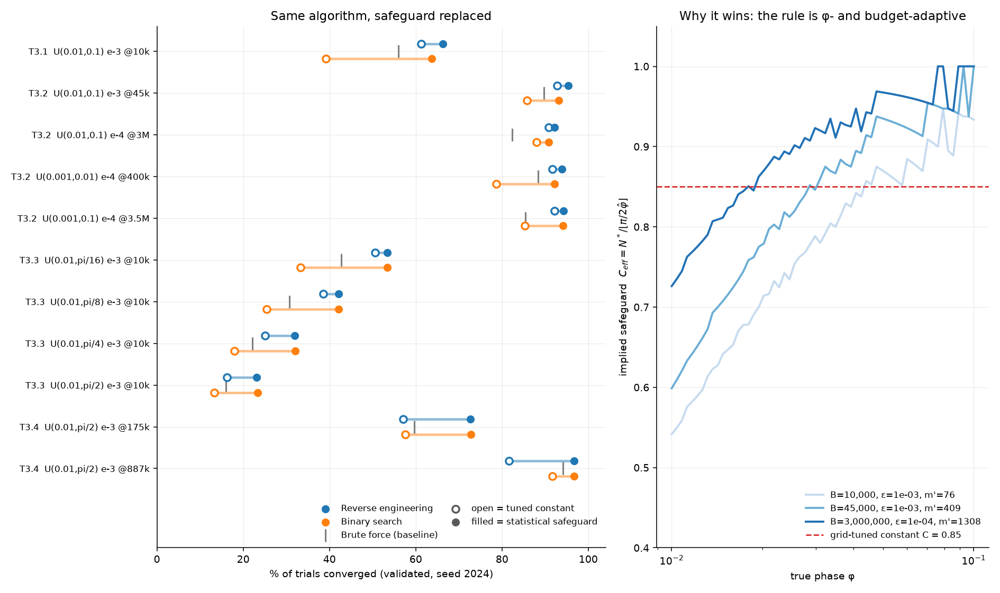

# Safeguard: grid-tuned constant vs. statistically derived depth

_One change only: the tuned safety factor `C_safe` (reverse engineering, Eq. 3.6) and the tuned decrement `s` (binary search) are replaced by the depth maximising `P(no overshoot) x P(converge)` under `phi_hat ~ N(phi, 1/(4 N^2 m))` (Eq. 3.4). Both arms are grid-tuned on seed 42 and validated on seed 2024 at R = 40,000; worst-case SE ≈ 0.25 pp._

| Operating point | brute | RE const-C | RE stat. | Δ | Binary const-s | Binary stat. | Δ |
|---|---:|---:|---:|---:|---:|---:|---:|
| T3.1  U(0.01,0.1) e-3 @10k | 55.9% | 61.3% | **66.2%** | +5.0 | 39.2% | **63.8%** | +24.6 |
| T3.2  U(0.01,0.1) e-3 @45k | 89.8% | 92.8% | **95.3%** | +2.6 | 85.8% | **93.2%** | +7.3 |
| T3.2  U(0.01,0.1) e-4 @3M | 82.3% | 90.9% | **92.1%** | +1.3 | 88.0% | **90.8%** | +2.8 |
| T3.2  U(0.001,0.01) e-4 @400k | 88.3% | 91.6% | **93.8%** | +2.2 | 78.7% | **92.2%** | +13.5 |
| T3.2  U(0.001,0.1) e-4 @3.5M | 85.4% | 92.2% | **94.2%** | +2.0 | 85.3% | **94.2%** | +8.9 |
| T3.3  U(0.01,pi/16) e-3 @10k | 42.8% | 50.5% | **53.3%** | +2.8 | 33.2% | **53.4%** | +20.1 |
| T3.3  U(0.01,pi/8) e-3 @10k | 30.7% | 38.5% | **42.1%** | +3.5 | 25.5% | **42.1%** | +16.6 |
| T3.3  U(0.01,pi/4) e-3 @10k | 22.1% | 25.1% | **32.0%** | +6.9 | 18.0% | **32.1%** | +14.1 |
| T3.3  U(0.01,pi/2) e-3 @10k | 16.0% | 16.2% | **23.1%** | +6.8 | 13.3% | **23.3%** | +10.1 |
| T3.4  U(0.01,pi/2) e-3 @175k | 59.6% | 57.1% | **72.6%** | +15.5 | 57.6% | **72.8%** | +15.2 |
| T3.4  U(0.01,pi/2) e-3 @887k | 94.1% | 81.6% | **96.7%** | +15.1 | 91.7% | **96.6%** | +4.9 |

**Reverse engineering:** 11/11 operating points improve, median +3.5 pp, max +15.5 pp.
**Binary search:** 11/11 improve, median +13.5 pp, max +24.6 pp.

The statistical rule also removes a tuned parameter from each algorithm: the winning configs below contain only `m_exploration` (and `conf` for binary search).

**It also needs a much cheaper pilot.** Reverse engineering's winning `m_exploration` is 5.3x smaller with the statistical safeguard (max 151x): because the rule scales the backoff to the pilot's own spread, it can act safely on a coarse estimate, whereas a constant C has to be bought with exploration shots.

## Winning configurations

| Operating point | RE const-C | RE stat. | Binary const-s | Binary stat. |
|---|---|---|---|---|
| T3.1  U(0.01,0.1) e-3 @10k | `{'m_exploration': 149, 'safeguard': 0.85}` | `{'m_exploration': 39, 'eps_target': 0.001}` | `{'m_exploration': 20, 'safeguard': 2, 'conf': 0.65}` | `{'m_exploration': 156, 'conf': 0.5, 'eps_target': 0.001}` |
| T3.2  U(0.01,0.1) e-3 @45k | `{'m_exploration': 409, 'safeguard': 0.85}` | `{'m_exploration': 149, 'eps_target': 0.001}` | `{'m_exploration': 33, 'safeguard': 2, 'conf': 0.5}` | `{'m_exploration': 732, 'conf': 0.5, 'eps_target': 0.001}` |
| T3.2  U(0.01,0.1) e-4 @3M | `{'m_exploration': 10582, 'safeguard': 0.975}` | `{'m_exploration': 1308, 'eps_target': 0.0001}` | `{'m_exploration': 936, 'safeguard': 2, 'conf': 0.9}` | `{'m_exploration': 259, 'conf': 0.65, 'eps_target': 0.0001}` |
| T3.2  U(0.001,0.01) e-4 @400k | `{'m_exploration': 373, 'safeguard': 0.85}` | `{'m_exploration': 70, 'eps_target': 0.0001}` | `{'m_exploration': 20, 'safeguard': 2, 'conf': 0.5}` | `{'m_exploration': 493, 'conf': 0.5, 'eps_target': 0.0001}` |
| T3.2  U(0.001,0.1) e-4 @3.5M | `{'m_exploration': 10582, 'safeguard': 0.925}` | `{'m_exploration': 861, 'eps_target': 0.0001}` | `{'m_exploration': 259, 'safeguard': 2, 'conf': 0.65}` | `{'m_exploration': 12164, 'conf': 0.5, 'eps_target': 0.0001}` |
| T3.3  U(0.01,pi/16) e-3 @10k | `{'m_exploration': 122, 'safeguard': 0.85}` | `{'m_exploration': 176, 'eps_target': 0.001}` | `{'m_exploration': 20, 'safeguard': 2, 'conf': 0.5}` | `{'m_exploration': 185, 'conf': 0.5, 'eps_target': 0.001}` |
| T3.3  U(0.01,pi/8) e-3 @10k | `{'m_exploration': 312, 'safeguard': 0.8}` | `{'m_exploration': 142, 'eps_target': 0.001}` | `{'m_exploration': 20, 'safeguard': 2, 'conf': 0.65}` | `{'m_exploration': 222, 'conf': 0.5, 'eps_target': 0.001}` |
| T3.3  U(0.01,pi/4) e-3 @10k | `{'m_exploration': 861, 'safeguard': 0.85}` | `{'m_exploration': 373, 'eps_target': 0.001}` | `{'m_exploration': 20, 'safeguard': 1, 'conf': 0.5}` | `{'m_exploration': 259, 'conf': 0.5, 'eps_target': 0.001}` |
| T3.3  U(0.01,pi/2) e-3 @10k | `{'m_exploration': 4585, 'safeguard': 0.8}` | `{'m_exploration': 861, 'eps_target': 0.001}` | `{'m_exploration': 20, 'safeguard': 2, 'conf': 0.8}` | `{'m_exploration': 936, 'conf': 0.5, 'eps_target': 0.001}` |
| T3.4  U(0.01,pi/2) e-3 @175k | `{'m_exploration': 130011, 'safeguard': 0.85}` | `{'m_exploration': 861, 'eps_target': 0.001}` | `{'m_exploration': 259, 'safeguard': 2, 'conf': 0.8}` | `{'m_exploration': 3375, 'conf': 0.5, 'eps_target': 0.001}` |
| T3.4  U(0.01,pi/2) e-3 @887k | `{'m_exploration': 300000, 'safeguard': 0.8}` | `{'m_exploration': 16074, 'eps_target': 0.001}` | `{'m_exploration': 493, 'safeguard': 2, 'conf': 0.8}` | `{'m_exploration': 23093, 'conf': 0.5, 'eps_target': 0.001}` |
