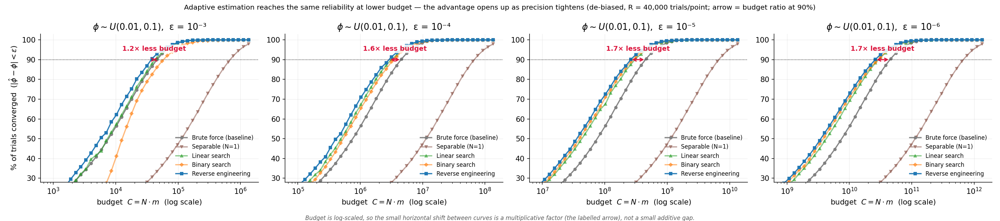
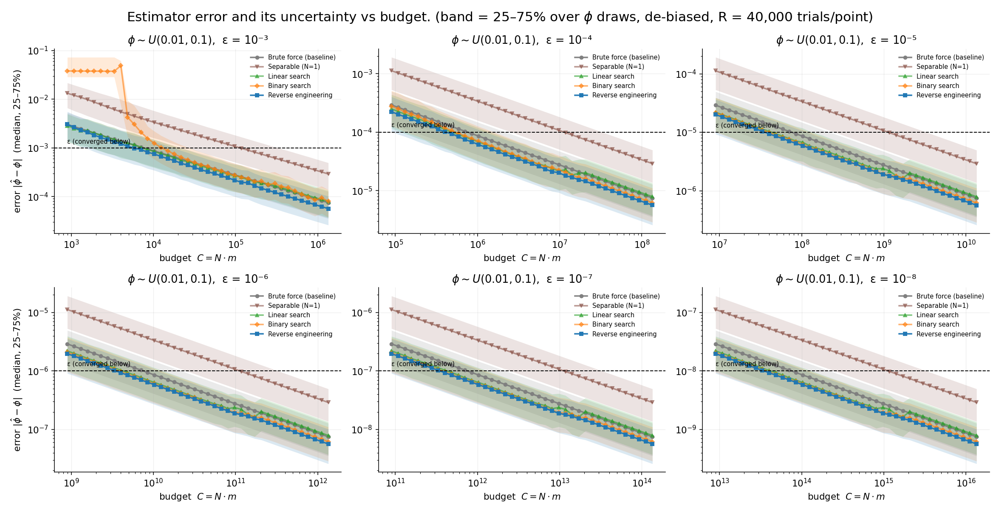
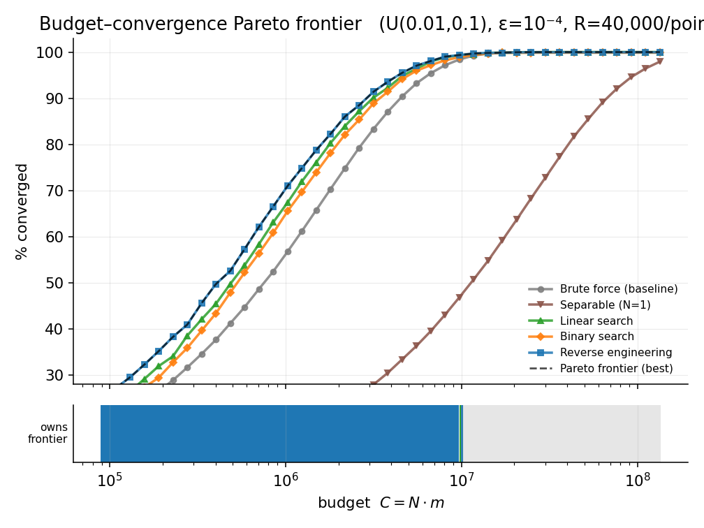
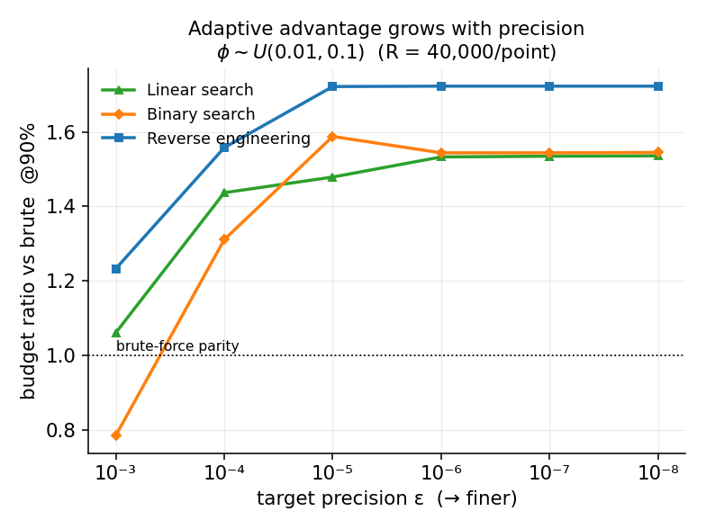

# Budget-ratio results — extensive de-biased sweep

_Generated by `analysis/extensive_sweep.py` + `analysis/render_story.py`. Metric = **budget ratio** `B_brute(p*)/B_algo(p*)`: how much less budget an algorithm needs to first reach convergence reliability p*. Every adaptive number is de-biased (grid-tuned on seed 42, winning config re-validated on independent seed 2024, R=40,000). Raw data: `story_curves.csv`, `story_cube.csv`._

## Table A — the field at one operating point ($\phi\sim U(0.01,0.1)$, ε=10⁻⁴, reach 90% convergence)

| Algorithm | Budget to reach 90% | Ratio vs brute |
|---|---:|---:|
| Brute force (baseline) | 4,504,343 | 1.00× |
| Separable (N=1) | 67,162,261 | _0.07×_ |
| Linear search | 3,135,633 | **1.44×** |
| Binary search | 3,436,485 | **1.31×** |
| Reverse engineering | 2,890,389 | **1.56×** |

_Ratio > 1 = needs that many times **less** budget than brute for the same 90% convergence (**bold** wins, _italic_ loses). De-biased: tuned on seed 42, validated on seed 2024._

## Table B — the main lever is precision ($\phi\sim U(0.01,0.1)$, reach 90%)

| Precision ε | Linear | Binary | Reverse eng. |
|---|---:|---:|---:|
| 10⁻³ | **1.06×** | _0.79×_ | **1.23×** |
| 10⁻⁴ | **1.44×** | **1.31×** | **1.56×** |
| 10⁻⁵ | **1.48×** | **1.59×** | **1.72×** |
| 10⁻⁶ | **1.53×** | **1.54×** | **1.72×** |
| 10⁻⁷ | **1.53×** | **1.54×** | **1.72×** |
| 10⁻⁸ | **1.54×** | **1.54×** | **1.72×** |

_The advantage grows with required precision — a tighter tolerance rewards the larger circuit depth N that the adaptive search selects._

## Table C — robustness across thresholds (best adaptive)

| Scenario | 50% | 80% | 90% | 95% | winner |
|---|---:|---:|---:|---:|---|
| U(0.01,0.1), eps=1e-03 | **1.35×** | **1.27×** | **1.23×** | **1.12×** | Reverse engineering |
| U(0.001,0.01), eps=1e-03 | 0.97× | **1.09×** | 1.02× | 0.97× | Linear search |
| U(0.01,0.1), eps=1e-04 | **1.84×** | **1.70×** | **1.56×** | **1.47×** | Reverse engineering |
| U(0.001,0.01), eps=1e-04 | **1.25×** | **1.26×** | **1.21×** | **1.19×** | Reverse engineering |
| U(0.01,0.1), eps=1e-05 | **2.13×** | **1.87×** | **1.72×** | **1.58×** | Reverse engineering |
| U(0.001,0.01), eps=1e-05 | **1.82×** | **1.67×** | **1.59×** | **1.46×** | Reverse engineering |
| U(0.01,0.1), eps=1e-06 | **2.16×** | **1.88×** | **1.72×** | **1.61×** | Reverse engineering |
| U(0.001,0.01), eps=1e-06 | **2.07×** | **1.81×** | **1.73×** | **1.58×** | Reverse engineering |
| U(0.01,0.1), eps=1e-07 | **2.17×** | **1.88×** | **1.72×** | **1.61×** | Reverse engineering |
| U(0.001,0.01), eps=1e-07 | **2.07×** | **1.81×** | **1.72×** | **1.58×** | Reverse engineering |
| U(0.01,0.1), eps=1e-08 | **2.17×** | **1.88×** | **1.72×** | **1.61×** | Reverse engineering |
| U(0.001,0.01), eps=1e-08 | **2.06×** | **1.79×** | **1.72×** | **1.58×** | Reverse engineering |
| U(0.001,0.1), eps=1e-04 | **2.05×** | **1.68×** | **1.55×** | **1.41×** | Reverse engineering |
| U(0.001,0.1), eps=1e-06 | **2.56×** | **2.00×** | **1.73×** | **1.59×** | Reverse engineering |
| U(0.0001,0.1), eps=1e-04 | **2.10×** | **1.68×** | **1.53×** | **1.34×** | Reverse engineering |
| U(0.0001,0.1), eps=1e-06 | **2.59×** | **1.98×** | **1.71×** | **1.55×** | Reverse engineering |
| U(0.0001,0.01), eps=1e-04 | **1.49×** | **1.36×** | **1.24×** | **1.14×** | Reverse engineering |
| U(0.0001,0.01), eps=1e-06 | **2.38×** | **1.94×** | **1.76×** | **1.57×** | Reverse engineering |
| U(0.005,0.05), eps=1e-04 | **1.68×** | **1.59×** | **1.50×** | **1.40×** | Reverse engineering |
| U(0.005,0.05), eps=1e-06 | **2.12×** | **1.80×** | **1.71×** | **1.58×** | Reverse engineering |
| U(0.0001,0.001), eps=1e-04 | 1.00× | _0.94×_ | _0.85×_ | _0.89×_ | Linear search |
| U(0.0001,0.001), eps=1e-06 | **1.81×** | **1.69×** | **1.59×** | **1.46×** | Reverse engineering |
| U(1e-05,0.01), eps=1e-05 | **2.06×** | **1.70×** | **1.54×** | **1.38×** | Reverse engineering |

_Ratio ≥ 1 in every cell ⇒ the budget advantage survives at every reliability target._

## Figures

