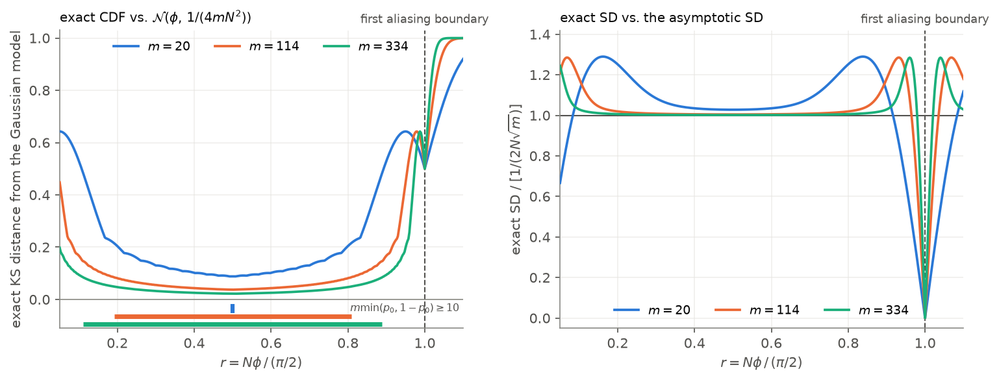

# Finite-sample justification of the Gaussian approximation

> **Superseded as the justification of the overshoot criterion.**
> The criterion rests on the *fold* (Eq. 2.85), not on normality — see
> [`../consolidated/OVERSHOOT_CRITERION.md`](../consolidated/OVERSHOOT_CRITERION.md).
> This document remains the supporting evidence for **Lemma 2.6.3 and the safeguard
> (Theorem 3.2.1)**, which do consume the Gaussian law, and it is evaluated under the safe
> hypothesis where that law is accurate. Recommendations A, C and E below still stand.

Generated by [`analysis/binary_gaussianity_audit.py`](../../analysis/binary_gaussianity_audit.py),
cross-checked against `main-thesis_newest_draft.pdf` and the replay in
[`analysis/binary_gaussianity_audit_old.py`](../../analysis/binary_gaussianity_audit_old.py).

> **These are recommendations for you, not edits.**
> Nothing in this session touched any `.tex` file, any figure directory, or any compiled PDF.
> Every snippet below is for **you** to paste manually.

All section, equation, lemma, table and figure numbers below are taken from
**`main-thesis_newest_draft.pdf`** and were verified against its text.

---

## 1. Scientific conclusion

Three claims, deliberately kept apart:

1. **Supported.** Away from the binomial endpoints, the raw one-shot estimator
   `phi_hat = arccos(sqrt(K/m))/N` is accurately described by the delta-method Gaussian of
   Lemma 2.6.3 at the exploration shot counts the sweep actually selects. Over the regular region
   of the principal branch, at all five selected shot counts `m = 114, 289, 334, 391, 2635`, the
   exact KS distance never exceeds `0.084`, the exact SD stays within `2.2 %` of `1/(2N sqrt(m))`,
   and the exact bias stays below `0.081` model SD.

2. **Not supported.** Gaussianity is *not uniform in `N`*. As `N phi -> pi/2` the readout
   probability `p_0 = cos^2(N phi)` collapses, the single outcome `K = 0` acquires almost all of
   the probability mass, and the law becomes degenerate rather than Gaussian. At the boundary
   itself `K = 0` deterministically. Exactly, at `phi = 0.05`, `m = 114`:

   | `N` | `p_0` | `P(K = 0)` | variance ratio | KS |
   |---:|---:|---:|---:|---:|
   | 30 | `5.00e-3` | 0.564 | 1.33 | 0.499 |
   | 31 (`= N_opt`) | `4.32e-4` | **0.952** | 0.188 | 0.623 |
   | 32 | `8.53e-4` | 0.907 | 0.354 | 0.734 |

   `N = 31` *is* `N_opt = floor(pi / (2 phi))` for `phi = 0.05` — the value Section 2.7 already
   names. The approximation is therefore already broken at the depth the adaptive algorithms aim
   for, and no realistic budget repairs it: reaching `m min(p_0, 1-p_0) >= 10` at `N = 31` would
   need `m ~ 23,000` shots, i.e. a cost of `C ~ 717,000`. So the Gaussian law **cannot by itself
   prove that the overshoot classifier of Eqs. (3.4)–(3.6) is calibrated** — precisely the region
   where the classifier must decide is the region where its model is worst.

3. **Empirically supported, from elsewhere.** (See `OVERSHOOT_CRITERION.md` for why the criterion
   nevertheless has a clean mechanism: the boundary degeneracy that breaks normality is exactly
   what makes the detector sharp.) That the complete algorithms nevertheless achieve
   low final overshoot rates is established by the end-to-end diagnostics of Section 4.5
   (Table 4.6: BS final overshoot 0.74 %, unsafe-guess rescue 96.4 %), not by the Gaussian
   derivation. The replay confirms this independently: **the deepest accepted pilot is strongly
   selection-biased** (mean `+1.18 sigma`, SD `0.79 sigma`, KS `0.498`) even though fresh regular
   probes at the same operating point are nearly standard normal (mean `+0.017`, SD `1.004`,
   KS `0.007`).

**Wording discipline:** these simulations do not "prove Gaussianity". Exact enumeration
*verifies the finitely many configurations tabulated*; the general result remains asymptotic and
conditional on `0 < N phi < pi/2`.

---

## 2. What was run

```
python analysis/binary_gaussianity_audit.py          # table, regular region, budget check, figure
python analysis/binary_gaussianity_audit_old.py      # full-algorithm replay (findings 5 and 7)
```

Fixed `phi = 0.05` (matching Section 2.7), `R = 50,000`, seed `20260825`, binomial sampling
(not per-shot Bernoulli). The KS distance and the exact variance are obtained by **enumerating
all `m + 1` outcomes** `K = 0..m`, so they carry no Monte-Carlo error; the reported `s_R^2` is a
genuine simulation result that cross-checks the enumeration.

The estimator has a *discrete* distribution — strictly a PMF, not a PDF — so the exact CDF is a
step function and the KS supremum is evaluated at each atom from both sides.

**Centring convention.** This audit centres the comparison Gaussian at the **true `phi`**, because
that is the model Eq. (3.4) actually asserts. The earlier audit centred it at the folded phase
`arccos(|cos(N phi)|)/N`. The two agree everywhere on the principal branch `r < 1` and differ only
past the boundary, where centring at the true `phi` is the stricter and more honest test. The
regular-region summary in §9 is identical under both conventions.

---

## 3. The table

| Configuration | `N` | `m` | `r = N phi/(pi/2)` | `m min(p0,1-p0)` | `s_R^2` | `1/(4mN^2)` | ratio | KS |
|---|---:|---:|---:|---:|---:|---:|---:|---:|
| very low shots, interior | 15 | 5 | 0.477 | 2.32 | 3.47e-04 | 2.22e-04 | 1.56 | 0.181 |
| low shots, interior | 15 | 20 | 0.477 | 9.29 | 5.89e-05 | 5.56e-05 | 1.06 | 0.0913 |
| selected Table 4.1 shot count | 15 | 114 | 0.477 | 53.0 | 9.94e-06 | 9.75e-06 | 1.02 | 0.0382 |
| old moderate-shot comparison | 15 | 400 | 0.477 | 186 | 2.80e-06 | 2.78e-06 | 1.01 | 0.0204 |
| near boundary | 30 | 114 | 0.955 | 0.570 | 3.24e-06 | 2.44e-06 | 1.33 | 0.499 |
| immediately below boundary | 31 | 114 | 0.987 | 0.0493 | 4.28e-07 | 2.28e-06 | 0.188 | 0.623 |
| immediately past boundary | 32 | 114 | 1.02 | 0.0972 | 7.74e-07 | 2.14e-06 | 0.361 | 0.734 |

`m = 114` is the shot count Table C.1 selects for binary search at `C = 10,000`, confirmed against
`results/consolidated/optimal_params.csv`.

**Caption (short form).** The first four rows hold the operating point fixed and increase the
shot count: variance ratio and KS distance both converge to the Gaussian prediction once both
expected outcome counts `m min(p_0, 1-p_0)` reach about ten. The last three rows move `N` towards
and across the first aliasing boundary `r = 1` and expose the non-uniform failure there.

### Ready-to-paste LaTeX

Needs `booktabs`. Verified to fit: typeset width **336 pt** against the thesis text width of
**383 pt** (measured from the compiled PDF: A4, Latin Modern, 10 pt base, so `\footnotesize`
is 8 pt). It still fits with 13 pt to spare even at 9 pt.

```latex
\begin{table}[htbp]
  \centering
  \footnotesize
  \setlength{\tabcolsep}{4pt}
  \caption{Finite-sample accuracy of the Gaussian approximation $\hat\phi\sim\mathcal{N}(\phi,\,1/(4mN^2))$ of Lemma~\ref{lem:asymptotic-normality} for the entangled estimator at $\phi=0.05$. The sample variance $s_R^2$ comes from $R=50{,}000$ simulated trials; the Kolmogorov--Smirnov distance is computed exactly by enumerating the $m+1$ possible outcomes $K=0,\dots,m$ and therefore carries no Monte-Carlo error. The first four rows hold the operating point fixed and increase the number of shots $m$: the variance ratio and the KS distance both approach the Gaussian prediction once both expected outcome counts $m\min(p_0,1-p_0)$ reach about ten. The last three rows move $N$ towards and across the first aliasing boundary $r=N\phi/(\pi/2)=1$, where $p_0\to 0$, the outcome $K=0$ takes almost all of the probability mass and the approximation fails outright.}
  \label{tab:gaussianity}
  \begin{tabular}{lrrrrrrrr}
    \toprule
    Configuration & $N$ & $m$ & $r$ & $m\min(p_0,1-p_0)$ & $s_R^2$ & $1/(4mN^2)$ & ratio & KS \\
    \midrule
    very low shots & 15 & 5 & $0.477$ & $2.32$ & $3.47\times 10^{-4}$ & $2.22\times 10^{-4}$ & $1.56$ & $0.181$ \\
    low shots & 15 & 20 & $0.477$ & $9.29$ & $5.89\times 10^{-5}$ & $5.56\times 10^{-5}$ & $1.06$ & $0.0913$ \\
    selected shot count & 15 & 114 & $0.477$ & $53.0$ & $9.94\times 10^{-6}$ & $9.75\times 10^{-6}$ & $1.02$ & $0.0382$ \\
    moderate shots & 15 & 400 & $0.477$ & $186$ & $2.80\times 10^{-6}$ & $2.78\times 10^{-6}$ & $1.01$ & $0.0204$ \\
    \midrule
    near boundary & 30 & 114 & $0.955$ & $0.570$ & $3.24\times 10^{-6}$ & $2.44\times 10^{-6}$ & $1.33$ & $0.499$ \\
    at $N_{\mathrm{opt}}$ & 31 & 114 & $0.987$ & $0.0493$ & $4.28\times 10^{-7}$ & $2.28\times 10^{-6}$ & $0.188$ & $0.623$ \\
    past boundary & 32 & 114 & $1.02$ & $0.0972$ & $7.74\times 10^{-7}$ & $2.14\times 10^{-6}$ & $0.361$ & $0.734$ \\
    \bottomrule
  \end{tabular}
\end{table}
```

---

## 4. Generated artifacts

| File | What it is |
|---|---|
| [`gaussianity_table.csv`](gaussianity_table.csv) | full data — also carries the exact variance ratio, exact bias in units of `sigma`, the PMF mass check and the MC-vs-exact z-score |
| [`gaussianity_table.md`](gaussianity_table.md) / [`.tex`](gaussianity_table.tex) | the tables above |
| [`regular_region_summary.csv`](regular_region_summary.csv) | worst-case KS / SD error / bias over the regular region at the five selected shot counts |
| [`second_probe_budget.csv`](second_probe_budget.csv) | the second-bisection-probe affordability check behind recommendation **E** |
| [`fig_gaussianity_boundary.pdf`](fig_gaussianity_boundary.pdf) / [`.png`](fig_gaussianity_boundary.png) | the **optional** figure (§8) |
| [`README.md`](README.md), `exact_normality_*.csv`, `operating_point_summary.csv`, `fig_exact_*`, `fig_operating_pilot_cdfs.*` | outputs of the earlier replay audit, regenerated against current code |

---

## 5. Suggested main-text prose (129 words)

> Table~\ref{tab:gaussianity} quantifies how accurately Equation~(2.47) describes the estimator
> at finite $m$. At a fixed interior operating point ($N=15$, $r\approx0.48$) the sample variance
> exceeds $1/(4mN^2)$ by 56\% at $m=5$, but by only 6\% at $m=20$ and 2\% at $m=114$; the exact
> Kolmogorov--Smirnov distance to the model falls from $0.181$ to $0.038$ over the same range.
> The approximation therefore becomes accurate once both expected outcome counts
> $m\min(p_0,1-p_0)$ reach roughly ten. It is not uniform in $N$, however: as $N\phi$ approaches
> $\pi/2$ the probability $p_0=\cos^2(N\phi)$ collapses and the outcome $K=0$ takes almost all of
> the mass, so at $N=N_{\mathrm{opt}}=31$ the variance ratio drops to $0.19$ while the KS distance
> rises to $0.62$. We consequently use the Gaussian law as a local design approximation rather
> than a uniform finite-sample guarantee.

Makes exactly the four claims the evidence supports and no more: (i) the asymptotic variance can
be inaccurate at very small `m`; (ii) both quantities converge once both expected counts reach
about ten; (iii) the approximation fails near the first aliasing boundary; (iv) it is therefore a
local design approximation. It deliberately does **not** present KS `< 0.1` as a hypothesis-test
threshold.

---

## 6. Recommended insertion locations

| # | Where | Anchor in `main-thesis_newest_draft.pdf` |
|---|---|---|
| **B** | **Section 2.7**, immediately after the first paragraph discussing Figure 2.5 | ends `"…the estimator variance closely approaches the QCRB, even for moderate values of N and m."` |
| **A** | **Lemma 2.6.3**, p. 10 — statement (2.36) and the remark after the proof (2.47) | `"Lemma 2.6.3 (Asymptotic distribution of the estimators). The estimators ϕ̂ are asymptotically normally distributed"` |
| **C** | **Section 2.7**, the sentence after Equation (2.84) | `"implying that the estimator converges to zero once the optimal choice of N is exceeded."` |
| **D** | **Section 3.2.2**, one sentence after Equation (3.4) | `"the no-overshoot approximation from Lemma 2.6.3 gives"` |
| **E** | **Section 4.2**, the paragraph discussing Table 4.1 | `"The poor performance of binary search in this setting indicates that the available budget is too small…"` |

Put the new table (B) **after** the paragraph, so it reads as verification of what was just claimed.

---

## 7. Ready-to-paste corrections

### A — Lemma 2.6.3: add the domain hypothesis

**Most of this recommendation is already done.** The current Lemma 2.6.3 already gives the correct
quantified form at Equation (2.46),

```
sqrt(m) (phi_hat - phi)  ->d  N(0, 1/(4 N^2)),
```

with (2.47) as the working approximation. What is still missing is the **hypothesis**. As stated,
(2.36) asserts asymptotic normality for the estimators unconditionally, but the proof defines
`g(p) = arccos(sqrt(p))/N` with

```
g'(p) = -1 / (2 N sqrt(p (1 - p))),
```

which is singular at `p in {0, 1}` — and Theorem 2.6.2 explicitly requires `g` smooth with
`g'(theta) != 0`. So the proof already needs `0 < p_0 < 1`; the statement should say so. Add the
hypothesis to the lemma:

```latex
\begin{lemma}[Asymptotic distribution of the estimators]
\label{lem:asymptotic-normality}
Let $p_0$ denote the true readout probability and assume $0 < p_0 < 1$, i.e.\ the estimator is
evaluated strictly inside its non-aliasing branch: $0 < N\phi < \pi/2$ for $\hat\phi_{ent}$ and
$0 < \phi < \pi/2$ for $\hat\phi_{sep}$. Then the estimators $\hat\phi$ are asymptotically normally
distributed
\begin{equation}
  \hat\phi \mid \phi \;\xrightarrow{\;d\;}\; \mathcal{N}(\phi, \sigma^2),
\end{equation}
\end{lemma}
```

and a remark after the proof (i.e.\ after Equation (2.47)):

```latex
The hypothesis $0 < p_0 < 1$ is essential and not merely technical. The derivative
$g'(p) = -1/\bigl(2N\sqrt{p(1-p)}\bigr)$ used in \eqref{eq:gprime} is singular at $p \in \{0,1\}$,
so Theorem~\ref{thm:delta-method} does not apply there. At the aliasing boundary $N\phi = \pi/2$
one has $p_0 = 0$, hence $k = 0$ almost surely and $\hat\phi_{ent} = \pi/(2N)$ is degenerate rather
than Gaussian. Section~\ref{sec:numerical-verification} quantifies how quickly the approximation
degrades as this boundary is approached.
```

Fix `\eqref` and `\ref` targets to your actual labels. **Do not otherwise touch the proof** — the
derivation of $1/(4mN^2)$ in (2.40)–(2.47) is correct as it stands.

### C — the sentence after Equation (2.84) contradicts Equation (2.85)

This is now an **internal inconsistency**, which makes it worth fixing regardless of Nina's
comment. Section 2.7 currently says after (2.84):

> *implying that the estimator converges to zero once the optimal choice of N is exceeded.*

but two pages later Equation (2.85) correctly gives the fold

```
phi_hat_N = arccos(|cos(N phi)|) / N
```

and calls it *"a non-smooth sawtooth shape"*. The estimator does **not** converge to zero once
`N_opt` is exceeded — only its **envelope** `pi/(2N)` does. Also, `|arccos(x)| <= pi` should be the
sharper `arccos(sqrt(p_0)) <= pi/2`, since `sqrt(p_0) in [0,1]`.

Replace the lead-in and the interpretation sentence with:

```latex
Because $\sqrt{p_0} \in [0,1]$ we have $\arccos(\sqrt{p_0}) \le \pi/2$, so the entangled estimator
is confined to $0 \le \hat\phi_{ent} \le \pi/(2N)$ and satisfies
% ... keep Equation (2.84) unchanged here ...
Note that this is a statement about the \emph{envelope} of the estimator, not about monotone decay:
past the first aliasing boundary $\hat\phi_{ent}$ folds onto the principal branch
\eqref{eq:folded-estimator} and follows a non-monotone sawtooth in $N$, since
$\arccos|\cos(N\phi)|$ is the distance from $N\phi$ to the nearest multiple of $\pi$ and oscillates
within $[0, \pi/2]$. Only the envelope $\pi/(2N)$ tends to zero as $N \to \infty$. It is this
folding, rather than convergence to zero, that Chapter~\ref{ch:methodology} exploits to detect that
$N_{\mathrm{opt}}$ has been overshot.
```

Two smaller things in the same passage:

- Consider moving Equation (2.85) **up** to just after (2.84), so the fold is introduced where it
  is first needed instead of two pages later.
- The next sentence reads *"This property will be employed in Section 4 to detect when …
  `N_opt` has been overshot"*, but overshoot detection is defined in **Chapter 3** (Methodology,
  Section 3.2.2). That cross-reference looks stale.

### D — binary search: add the cross-reference only

The methodology text **already** contains the right warning — *"Because the unknown mean is
replaced by a noisy and adaptively selected estimate, and because the uncertainty of this reference
estimate is not included, the procedure is a heuristic classification rule rather than an exact
confidence test."* Leave Eqs. (3.4)–(3.6), Theorem 3.2.1 and the safeguard derivation untouched.
Add one sentence after (3.4):

```latex
Section~\ref{sec:numerical-verification} quantifies the finite-$m$ accuracy of this approximation
and its failure near the first aliasing boundary; note in particular that the approximation is
weakest exactly where the classifier has to decide.
```

### E — results disclosure

```latex
For the selected BS configuration the remaining budget does not permit the second bisection probe
($m'(N_{\min} + N_{\text{mid}}) = 11{,}514 > 10{,}000$), so this operating point uses the opening
pilot followed directly by the statistical safeguard.
```

> ⚠️ **The surrounding paragraph is stale and contradicts its own table.** Section 4.2 currently
> says binary search shows *"poor performance"* and that *"all adaptive strategies except binary
> search beat the baseline"* on the budget metric. But Table 4.1 now reports BS at **65.07 %**
> (second best, well above the baseline's 56.09 %) and **32,400** budget for >90 % convergence
> (better than both BF's 45,900 and LS's 42,500). The same staleness appears in Chapter 5, which
> still quotes *"60.3 % versus 56.2 %"* and says binary search *"fell behind"*. Fix that prose
> before inserting the sentence above, otherwise the disclosure reads as an explanation for a
> failure that the table no longer shows. The correct framing is that the second probe is
> unaffordable **and BS still performs well**, because the opening pilot plus the statistical
> safeguard is doing the work.

---

## 8. The optional figure — recommendation: **do not include it**



Two panels over `r = N phi / (pi/2)` in `[0.05, 1.10]` for `m = 20, 114, 334`. Left: exact KS
distance from `N(phi, 1/(4 m N^2))`. Right: exact SD divided by `1/(2 N sqrt(m))`. The dashed line
marks the first aliasing boundary `r = 1`; the coloured bars under the left axis mark where
`m min(p_0, 1-p_0) >= 10`.

Both panels depend on `(m, r)` only — standardising gives
`(phi_hat - phi)/sigma = 2 sqrt(m) [arccos(sqrt(K/m)) - N phi]`, which involves `N` and `phi` only
through `N phi` — so the curves are exact for every `(N, phi)` pair with that `r`.

**Suggested caption if you do use it.** *Exact finite-sample departure of the entangled estimator
from `N(phi, 1/(4mN^2))`, as a function of the fraction `r = N phi/(pi/2)` of the way to the first
aliasing boundary. Both panels are computed by enumerating all `m+1` outcomes. The two-sided
regularity region `m min(p_0, 1-p_0) >= 10` is `r in [0.19, 0.81]` for `m = 114` and
`r in [0.11, 0.89]` for `m = 334`; for `m = 20` it degenerates to the single point `r = 0.5`,
since `m min(p_0, 1-p_0) <= m/2`. KS values are reported as descriptive distances, not as a
hypothesis test.*

**Why leave it out.** The page-minimal proposal is the existing Figure 2.5 plus the new table.
The table already carries the two claims that matter, and Nina's objection to the old Figure 3.1
was precisely that a figure was doing work a number should do. Include it only if you decide the
table alone reads as too thin.

---

## 9. Verification record

Everything below was re-run against the current code and the current
`results/consolidated/optimal_params.csv`.

| Check | Result |
|---|---|
| Every enumerated PMF sums to one | max `\|sum - 1\|` = `6.66e-16` |
| MC sample variances agree with exact transformed-binomial variances | max `\|z\|` = `1.62` over the seven rows |
| KS comparison centred at the true `phi` | yes — the audited model is exactly Eq. (3.4)/(2.47), including the three post-boundary rows |
| Reproduces the expected anchors | all seven KS values match to three decimals; variance ratios match within Monte-Carlo error |
| LaTeX table fits `\textwidth` in `\footnotesize` | 336 pt vs 383 pt measured text width |
| Figure inspected in PDF and PNG | yes, both rendered and checked |
| Selected shot count `m = 114` still current | yes — Table C.1 and `optimal_params.csv` agree |
| Thesis build artifacts | untouched |

**Regular region of the principal branch** (`m min(p_0, 1-p_0) >= 10`), at the five selected
exploration shot counts — this reproduces the earlier audit's headline numbers exactly, and is
identical under both centring conventions:

| `m` | grid points | max KS | median KS | max SD error | max abs. bias |
|---:|---:|---:|---:|---:|---:|
| 114 | 61 | 0.0814 | 0.0482 | 1.93 % | 0.068 `sigma` |
| 289 | 77 | 0.0841 | 0.0337 | 2.16 % | 0.078 `sigma` |
| 334 | 77 | 0.0785 | 0.0313 | 1.81 % | 0.072 `sigma` |
| 391 | 79 | 0.0789 | 0.0298 | 1.84 % | 0.073 `sigma` |
| 2635 | 93 | 0.0830 | 0.0126 | 2.13 % | 0.081 `sigma` |

---

## 10. Previously carried-forward findings — now all verified

The earlier session's findings were re-derived rather than trusted. All five reproduce.

**Second bisection probe affordable?** (exact, from `optimal_params.csv`)

| operating point | `B` | `m` | needs `m(N_min + N_mid)` | fits? | replayed probes/trial |
|---|---:|---:|---:|:---:|---:|
| Table 4.1 | 10,000 | 114 | 11,514 | **no** | 1.00 |
| narrow `1e-3` near `B90` | 29,173 | 289 | 29,189 | **no** | 1.00 |
| narrow `1e-4` near `B90` | 2,917,365 | 334 | 33,734 | yes | 8.33 |
| small `1e-4` near `B90` | 394,843 | 391 | 398,820 | **no** | 1.00 |
| wide `1e-4` near `B90` | 2,059,436 | 2,635 | 2,126,445 | **no** | 1.00 |

Four of five reproduce to the digit; only the narrow `1e-4` point performs repeated bisection.

**Pilot normality** (replay, 20,000 trials per point):

| operating point | opening pilot KS | mean | SD | deepest accepted pilot KS | mean | SD |
|---|---:|---:|---:|---:|---:|---:|
| Table 4.1 | 0.0132 | +0.026 | 1.036 | 0.0132 | +0.026 | 1.036 |
| narrow `1e-3` near `B90` | 0.0055 | +0.001 | 1.012 | 0.0055 | +0.001 | 1.012 |
| narrow `1e-4` near `B90` | 0.0046 | +0.003 | 1.016 | **0.4981** | **+1.184** | **0.789** |
| small `1e-4` near `B90` | 0.0143 | +0.036 | 1.011 | 0.0143 | +0.036 | 1.011 |
| wide `1e-4` near `B90` | 0.0082 | −0.016 | 1.000 | 0.0082 | −0.016 | 1.000 |

Opening pilots: KS `0.005`–`0.014`, mean within `0.04 sigma`, SD `1.00`–`1.04 sigma` — as reported.
The two columns coincide wherever only one probe is taken, which is exactly the four
budget-limited points. At the one point with active bisection, the **selection bias is severe**:
`+1.18 sigma` with SD `0.79 sigma` and KS `0.498`, while fresh regular probes there are nearly
standard normal (mean `+0.017`, SD `1.004`, KS `0.007`, over the 62.1 % of probes meeting the
regularity marker).

This is why recommendation **D** stops at a cross-reference: the raw Gaussian law can be defended
locally, but it cannot establish that the adaptively selected deepest probe is an unbiased Gaussian
pilot, nor that the overshoot rule is an exactly calibrated test.

> One caveat on those replay numbers: the per-point false-alarm and miss rates at the active
> bisection point (57.6 % and 12.3 %) are **not** the Table 4.5 figures (22.8 % and 4.1 %). The
> thesis values are aggregated over 144 informative operating points; this one is a single,
> deliberately hard point. Do not substitute one for the other.
