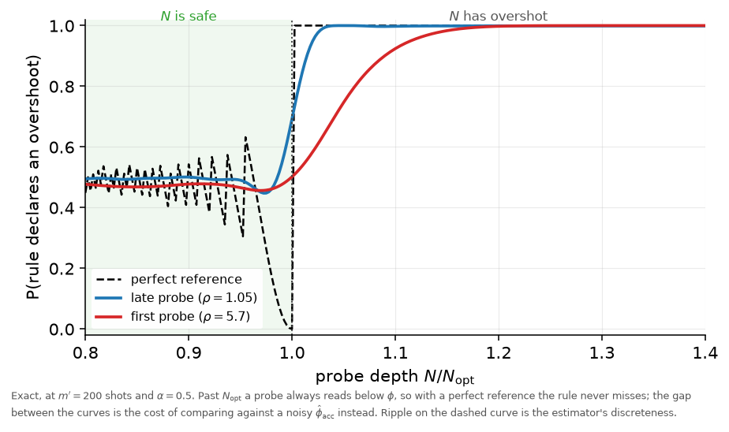

# Justifying the one-shot overshoot criterion

> Recommendations only — no `.tex` file was touched.

---

## The verdict, in one paragraph

Your argument was right; it was just stated in a form that does not cover the case where the rule
is actually used. You justified the overshoot test with the limit `phi_hat -> 0 as N -> infinity`.
The test, however, fires at an `N` only a few percent past `N_opt`, where no limit has taken effect
— and "tends to zero" is not even a correct description there, since the estimate oscillates rather
than decays. The repair is to replace the limit with an inequality you already have: because
`arccos` returns a value in `[0, pi/2]`, every estimate satisfies `N * phi_hat <= pi/2`. Overshooting
means `N * phi > pi/2`. Put together, **at any overshooting `N`, and for every possible measurement
outcome, `phi_hat <= pi/(2N) < phi`** — the probe always reads below the truth, with probability
one, at every `N` past `N_opt`, for any number of shots. That is a finite-`N`, non-asymptotic,
non-statistical statement, and it is the whole correctness argument. Its immediate consequence is
the one genuinely new result here: if the rule compared against the true `phi` it could never miss
an overshoot, so **every miss is caused by the reference `phi_hat_acc` being noisy, not by the
probe** — and at `alpha = 0.5`, the value your sweep selected, that is the *only* source of misses.
The measurements then quantify what that costs (a blind spot of 1.4 % in `N` for a late probe,
9 % for the first one) and confirm that binary search structurally protects itself, because the
bracket narrows in step with the difficulty of the decision.

**Is this different from your argument, or just fleshed out?** Same argument, with a specific
defect repaired. See §5 for exactly which shortcomings were resolved and how.

---

## 1. The mechanism

### 1.1 What the rule is

At a candidate `N`, binary search takes `m'` shots, forms `phi_hat_N`, and compares it against the
deepest estimate already accepted, `phi_hat_acc`:

```
declare "N has overshot"   if   phi_hat_N  <  phi_hat_acc + z_alpha / (2 N sqrt(m'))
```

We must justify why "the new estimate came out lower than the old one" is evidence that `N` is too
large.

### 1.2 The one inequality that does the work

The estimator is `phi_hat = arccos(sqrt(K/m')) / N`, where `K` counts `0` outcomes. Whatever `K`
turns out to be, `sqrt(K/m')` lies in `[0, 1]`, and `arccos` of anything in `[0, 1]` lies in
`[0, pi/2]`. Therefore

```
N * phi_hat  <=  pi/2          i.e.    phi_hat  <=  pi / (2N).
```

The estimator simply cannot report a phase above `pi/(2N)`. But "`N` has overshot" *means*
`N * phi > pi/2`. Chaining the two:

```
phi_hat  <=  pi/(2N)  <  phi.
```

**An overshooting probe always reads below the truth.** Not on average, not asymptotically — for
every single outcome `K`, at every `N` past `N_opt`, for any shot count. Verified numerically over
200,000 random overshooting configurations: `max(phi_hat - phi) = 0` exactly, never positive.

This is the same bound your thesis already invokes for Eq. (2.84) — it just needs to be `pi/2`
rather than `pi`, and to be read as a statement about finite `N` rather than a limit.

### 1.3 Why that immediately explains the detector

If the rule could compare `phi_hat_N` against the true `phi`, §1.2 says it would fire every single
time `N` overshot: **a miss would be impossible.** It cannot do that, because `phi` is unknown. It
compares against `phi_hat_acc` instead. So:

> Every miss is caused by the reference, not by the probe.

At `alpha = 0.5` — the value your grid search picked — `z_alpha = 0` and the threshold is exactly
`phi_hat_acc`, so reference noise is the *only* source of misses. (With `alpha < 0.5` the threshold
sits below the reference, which creates a second, deliberate blind spot.) This is a good reason to
prefer `alpha = 0.5` and worth one sentence in the thesis.

### 1.4 How far below does an overshooting probe read?

For the correctness argument, "below" was enough. To size the blind spot we need the amount. Past
the boundary the readout probability `cos^2(N phi)` corresponds to an angle that `arccos` reports as
`pi - N phi`, so `phi_hat = (pi - N phi)/N`. Using `N_opt = pi/(2 phi)`:

```
phi_hat / phi  =  2 N_opt / N  -  1
```

No new symbol is needed — just `N` and `N_opt`, both already defined. Example: `phi = 0.05` gives
`N_opt = 31.4`; probing `N = 35` (11 % too deep) yields `phi_hat/phi = 2(31.4)/35 - 1 = 0.795`, so
the probe reads **20.5 % below the truth**.

---

## 2. What the measurements add

Everything is exact — no simulation. A probe and its reference each have only `m'+1` possible
outcomes, so `P(rule fires)` is a sum over all `(m'+1)^2` pairs.

Only one auxiliary symbol is used: `rho = N / N_acc`, how much deeper the probe is than the estimate
it is compared against. It is a measure of reference quality — the reference's noise is `rho` times
the probe's, so `rho` near 1 is a good reference.

### The figure



What it shows, left to right:

- **Everything jumps to 1 past `N/N_opt = 1`.** That is §1.2 made visible.
- **The dashed curve (perfect reference) is a clean step**: zero misses above 1, and — a bonus —
  the false-alarm rate collapses to zero just *below* 1 too, because a safe probe near the boundary
  is biased upward and so never reads low. With a known `phi` the rule would be essentially ideal
  near the boundary, which is the only place it matters.
- **The two solid curves are the price of a noisy reference.** Blue is a late probe (`rho = 1.05`),
  red is the first one (`rho = 5.7`). The gap between blue and red is entirely reference quality;
  the shot count is identical.
- **The flat level near 0.5 on the left is the false-alarm rate**, and it is intentional — see the
  table note below.

### The table

| Reference `phi_hat_acc` | False alarms at `N = 0.9 N_opt` | Overshoot caught from `N/N_opt >=` | Relative error left by a missed overshoot |
|---|---:|---:|---:|
| perfect (`phi_hat_acc = phi`) | 54 % | 1.002 | 0.5 % |
| late probe (`rho = 1.05`) | 50 % | 1.014 | 2.9 % |
| first probe (`rho = 5.7`) | 48 % | 1.090 | 16.4 % |

Three things to read from it:

1. **The blind spot is small where it matters.** A late probe catches any overshoot beyond 1.4 % in
   `N`; anything it misses leaves under 3 % relative error.
2. **Reference quality, not shots, is the limit.** Going from the first probe to a late one shrinks
   the blind spot from 9 % to 1.4 % in `N`, at *identical* `m'`. Raising `m'` from 50 to 800 at
   fixed `rho = 5.7` only takes the missed-overshoot error from 33 % to 9 %, i.e. a sixteen-fold
   increase in shots buys less than switching to a good reference does. Shots spent improving the
   reference are worth more than shots spent on a deeper probe.
3. **The ~50 % false-alarm rate is by construction, not a defect.** At `alpha = 0.5` the rule keeps
   `N` only if the new probe reads at least as high as the old one, which a safe probe does about
   half the time. A false alarm only makes the search stop at a smaller `N`; a missed overshoot
   corrupts the final answer. The asymmetry is the right way round, and it shows up in Table 4.5 as
   BS's median `N_guess/N_opt = 0.93` with a guess-overshoot rate of only 4.1 %.

### Binary search protects itself

The rule needs a good reference exactly when the call is close. Binary search supplies one for
free, because the bracket narrows as the search proceeds. For `phi = 0.02` (`N_opt = 78`,
`N` ranging over 15–157):

| probe | `N` | `N_acc` | `rho` | `N/N_opt` | truth |
|---:|---:|---:|---:|---:|---|
| 1 | 86 | 15 | 5.73 | 1.095 | overshoot |
| 2 | 51 | 15 | 3.40 | 0.649 | safe |
| 3 | 68 | 51 | 1.33 | 0.866 | safe |
| 4 | 77 | 68 | 1.13 | 0.980 | safe |
| 5 | 81 | 77 | 1.05 | 1.031 | overshoot |
| 6 | 79 | 77 | 1.03 | 1.006 | overshoot |

The bad reference (`rho = 5.7`) is used on an easy call (`N/N_opt = 1.095`, far past the boundary).
The genuinely hard calls (`1.006`, `0.980`) arrive last, when `rho` has already fallen to `1.03`.
**Difficulty and reference quality improve together.** This is the strongest single argument that
the rule is sound rather than lucky, and it is not currently in the thesis.

### One number that is not achieved

If you set `alpha` to a conventional 0.05 expecting a 5 % false-alarm rate, you would not get it:
the achieved rate is 2.6 % with a perfect reference but 11 % for a late probe and 37 % for the first
one, because the reference's own uncertainty is not propagated. This is a number for the caveat
your text already makes, and it explains why `alpha` had to be grid-searched rather than set to a
textbook confidence level — as a confidence level it is not meaningful; as a position on a
sensitivity/false-alarm trade-off it is.

---

## 3. What is settled and what is still open

**Settled.** The rule has a correctness argument that holds at finite `N` (§1.2), an explanation of
why misses exist at all (§1.3), a quantified blind spot, and a measured false-alarm rate. You can
write a justification rather than an apology.

**Also settled:** the Gaussian approximation is *not* what makes the rule work, so its breakdown
near the aliasing boundary is not an objection to the rule. It is what the *safeguard* needs
(Theorem 3.2.1), and there it is applied at safe `N`, where it is accurate — exact KS `<= 0.084`,
SD within 2.2 %, at every selected shot count. That answers Nina's original complaint at the root
instead of patching it.

**Open — put these in Section 4.6:**

1. **Selection bias in the reference.** The analysis treats `phi_hat_acc` as an ordinary draw at
   `N_acc`. It is not: it is the *deepest accepted* probe, so it has survived a filter favouring
   high values. Measured, it sits `+1.18 sigma` high with SD `0.79 sigma`. A reference biased upward
   raises the threshold and produces more false alarms than even the `rho = 5.7` row suggests. The
   direction is conservative — it costs depth, not correctness — but it is not quantified.
2. **One probe at a time.** All of this is a single-probe operating characteristic. A run takes
   about 4.4 dependent probes, so the trial-level rates in Table 4.5 (22.8 % false alarm, 4.1 %
   miss) do not follow from these curves.
3. **No end-to-end guarantee.** Nothing here bounds the final overshoot rate. That figure (0.74 %)
   stays empirical, and Table 4.6 shows the safeguard contributes materially, rescuing 96.4 % of
   unsafe guesses.

---

## 4. Exactly what to put in the thesis

### Placement

| What | Where |
|---|---|
| §1.2 inequality + §1.4 magnitude | **Section 3.2.2**, immediately after Eq. (3.6) |
| `tab:overshoot-operating` | **Section 3.2.2**, after that paragraph |
| `fig_overshoot_criterion` | **optional**; see the note below |
| bracket-walk sentence | **Section 3.2.2**, closing the subsection |
| Gaussianity table | **Section 2.7**, after the Figure 2.5 paragraph — it supports Lemma 2.6.3 and hence the safeguard |
| the three open issues | **Section 4.6** |

Nothing goes in Section 4.5: that section reports what the detector *did*; this explains why it
*can* work.

Everything uses `N`, `N_opt`, `m'` and `alpha`, all already defined in Chapter 3, plus `rho` for the
table. The illustrative shot count is a round `m' = 200`, deliberately not one of the sweep's tuned
values, so nothing from Appendix C leaks forward.

### On the figure — my recommendation is to leave it out

The table carries both claims (blind spot size, reference quality dominates) in less space, and
Nina's objection to the old Figure 3.1 was exactly that a figure was doing work a number should do.
Include it only if you want the step at `N_opt` to be visually obvious. If you do include it, use
the caption in §5 below.

### Paragraph 1 — after Eq. (3.6). Suggested text (87 words)

> The rule is not arbitrary. Since $\arccos$ takes values in $[0,\pi/2]$, every estimate satisfies
> $N\hat\phi_N \leq \pi/2$, while overshooting means precisely $N\phi > \pi/2$. Hence at any
> $N > N_{\mathrm{opt}}$, and for every measurement outcome,
> $\hat\phi_N \leq \pi/(2N) < \phi$: an overshooting probe always reads below the true phase. The
> shortfall is quantified by $\hat\phi_N/\phi = 2N_{\mathrm{opt}}/N - 1$, so a probe $11\%$ deeper
> than $N_{\mathrm{opt}}$ reports a phase $20.5\%$ too low. Compared against $\phi$ the rule could
> therefore never miss an overshoot; it misses only because $\hat\phi_{\mathrm{acc}}$ is itself
> noisy, and at $\alpha = 0.5$ that is the sole source of misses.

### Paragraph 2 — introducing the table

State the three readings listed under "The table" above, in that order. The third one — that the
~50 % false-alarm rate is deliberate, because a false alarm costs depth while a miss costs
correctness — is the natural bridge into the "Safeguard for `N`" subsection that follows.

### Paragraph 3 — closing the subsection (bracket walk)

> The rule needs a precise reference exactly when the decision is close, and binary search supplies
> one automatically: the bracket narrows as the search proceeds, so the probes landing near
> $N_{\mathrm{opt}}$ are the late ones, by which point $N_{\mathrm{acc}}$ is within a few percent of
> $N$. For $\phi = 0.02$ the first probe compares against a reference $5.7$ times shallower but
> faces a decision at $N = 1.10\,N_{\mathrm{opt}}$, while the probes at $1.006$ and $0.980$ arrive
> with $\rho \approx 1.03$.

### Small edits this depends on

- **Fix the sentence after Eq. (2.84).** It says the estimator "converges to zero once the optimal
  choice of `N` is exceeded". It does not: it oscillates, and only the envelope `pi/(2N)` decays.
  Replace with the finite-`N` statement of §1.2. This now matters more, because Section 3.2.2 cites
  that bound directly.
- **Sharpen the bound in the same sentence** from `|arccos(x)| <= pi` to `arccos(sqrt(p_0)) <= pi/2`.
  The factor of two is what makes the detector argument work.
- **Fix the forward reference.** Section 2.7 says the property "will be employed in Section 4";
  overshoot detection is defined in Chapter 3.
- **Give Eq. (3.6) a label** (`eq:overshoot-threshold`) — the generated table's caption cites it.
- **Lemma 2.6.3 still needs its `0 < p_0 < 1` hypothesis**, and Section 4.2's prose still
  contradicts Table 4.1 about binary search. Details in
  [`../binary_gaussianity/GAUSSIANITY_HANDOFF.md`](../binary_gaussianity/GAUSSIANITY_HANDOFF.md).

### Figure caption, if you use it

> Reliability of the overshoot rule as a function of how deep the probe is, at $m'=200$ and
> $\alpha=0.5$. Computed exactly: a probe and its reference each have $m'+1$ possible outcomes, so
> the probability is a sum over all $(m'+1)^2$ pairs. Past $N_{\mathrm{opt}}$ an overshooting probe
> always reads below $\phi$, so against a known $\phi$ the rule would never miss (dashed); the gap
> to the solid curves is the cost of comparing against a noisy $\hat\phi_{\mathrm{acc}}$ instead,
> with $\rho = N/N_{\mathrm{acc}}$ measuring how much shallower that reference is. The ripple on the
> dashed curve is the estimator's discreteness, not numerical error.

---

## 5. Did this resolve the shortcomings of your justification?

| Your justification | The problem with it | How it is resolved |
|---|---|---|
| "past `N_opt` the estimate tends to zero" | It is an `N -> infinity` limit, but the rule fires at `N` a few percent past `N_opt`, where the limit says nothing. The justification did not cover the case it was used for. | Replaced by `N phi_hat <= pi/2`, which holds at **every** `N`. The conclusion `phi_hat < phi` is exact at the `N` values the rule actually tests. |
| "…converges to zero" | Factually wrong as a description of the behaviour: the estimate oscillates as `N` grows; only the envelope decays. A reader who checks will find the contradiction with Eq. (2.85). | The new statement makes no claim about decay at all. It only says the estimate is *bounded above* by `pi/(2N)`, which is all the rule needs and is unambiguously true. |
| bound quoted as `\|arccos(x)\| <= pi` | Too weak by a factor of two; with `pi` the chain `phi_hat <= pi/N < phi` does not close. | Sharpened to `arccos(sqrt(p_0)) <= pi/2`, valid because `sqrt(p_0) in [0,1]`. |
| no account of when the rule fails | The rule was presented as a heuristic with no error analysis, which is what drew the criticism. | Misses are now attributed to a single identified cause (reference noise), and the blind spot is measured: 1.4 % in `N` for a late probe, 9 % for the first. |
| nothing said about false alarms | A ~50 % false-alarm rate looks alarming if it is discovered rather than declared. | It is now derived (`alpha = 0.5` means "accept only if the new probe reads at least as high"), and justified by the cost asymmetry. |

**What is genuinely new rather than just tidier:** the observation that a perfect reference would
make misses *impossible*, which pins the entire failure mode on `phi_hat_acc`; the measurement
showing reference quality beats shot count; and the bracket-walk observation that binary search
supplies a good reference exactly when it needs one.

**What is still not proven:** that the algorithm converges. §3 lists the three gaps. The honest
position is a derived mechanism plus a quantified detector, with residual risk explicitly delegated
to the safeguard and measured in Chapter 4.

---

## 6. Artifacts

```
python analysis/consolidated/overshoot_criterion.py          # the three CSVs
python analysis/consolidated/thesis_tables.py                # -> tex/thesis/tab_overshoot_operating.tex
python analysis/consolidated/thesis_figures.py --only overshoot
```

| File | Contents |
|---|---|
| [`overshoot_power.csv`](overshoot_power.csv) | exact `P(rule fires)` on a 241-point `N/N_opt` grid, for each `(m', alpha, reference)` |
| [`overshoot_operating.csv`](overshoot_operating.csv) | the table's numbers, for `m'` = 50, 200, 800 and `alpha` = 0.5, 0.05 |
| [`overshoot_bracket_walk.csv`](overshoot_bracket_walk.csv) | the probe sequences behind the bracket-walk table |
| [`tex/thesis/tab_overshoot_operating.tex`](tex/thesis/tab_overshoot_operating.tex) | ready to `\input`; measured 276 pt against a 383 pt text width |
| [`fig_overshoot_criterion.pdf`](fig_overshoot_criterion.pdf) / [`.png`](fig_overshoot_criterion.png) | the single-panel figure above |

The computation lives in `overshoot_criterion.py` and writes tidy CSVs; `thesis_tables.py` and
`thesis_figures.py` only read them, matching the pipeline's "nothing here simulates" contract, so
the table and figure cannot disagree. Both skip gracefully if the CSVs are absent.

The Gaussianity work in [`../binary_gaussianity/`](../binary_gaussianity/) remains valid and is
still recommended — but as support for **Lemma 2.6.3 and the safeguard**, which is where the normal
approximation is actually used and actually holds.
